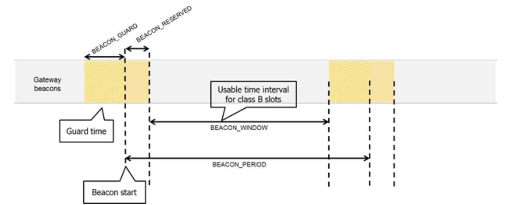

# **LoRa Specification**

Copyright © 2015 LoRa Alliance, Inc. All rights reserved.

NOTICE OF USE AND DISCLOSURE
---

Copyright © LoRa Alliance, Inc. (2016). All Rights Reserved.

The information within this document is the property of the LoRa Alliance ("The Alliance") and its use and disclosure are subject to LoRa Alliance Corporate Bylaws, Intellectual Property Rights (IPR) Policy and Membership Agreements.

Elements of LoRa Alliance specifications may be subject to third party intellectual property rights, including without limitation, patent, copyright or trademark rights (such a third party may or may not be a member of LoRa Alliance). The Alliance is not responsible and shall not be held responsible in any manner for identifying or failing to identify any or all such third party intellectual property rights.

This document and the information contained herein are provided on an "AS IS" basis and THE ALLIANCE DISCLAIMS ALL WARRANTIES EXPRESS OR IMPLIED, INCLUDING BUT NOTLIMITED TO (A) ANY WARRANTY THAT THE USE OF THE INFORMATION HEREINWILL NOT INFRINGE ANY RIGHTS OF THIRD PARTIES (INCLUDING WITHOUTLIMITATION ANY INTELLECTUAL PROPERTY RIGHTS INCLUDING PATENT, COPYRIGHT OR TRADEMARK RIGHTS) OR (B) ANY IMPLIED WARRANTIES OF MERCHANTABILITY, FITNESS FOR A PARTICULAR PURPOSE,TITLE OR NONINFRINGEMENT.

IN NO EVENT WILL THE ALLIANCE BE LIABLE FOR ANY LOSS OF PROFITS, LOSS OF BUSINESS, LOSS OF USE OF DATA, INTERRUPTION OFBUSINESS, OR FOR ANY OTHER DIRECT, INDIRECT, SPECIAL OR EXEMPLARY, INCIDENTIAL, PUNITIVE OR CONSEQUENTIAL DAMAGES OF ANY KIND, IN CONTRACT OR IN TORT, IN CONNECTION WITH THIS DOCUMENT OR THE INFORMATION CONTAINED HEREIN, EVEN IF ADVISED OF THE POSSIBILITY OF SUCH LOSS OR DAMAGE.

The above notice and this paragraph must be included on all copies of this document that are made.

LoRa Alliance, Inc.  
2400 Camino Ramon, Suite 375  
San Ramon, CA 94583

*Note: All Company, brand and product names may be trademarks that are the sole property of their respective owners.*

The authors reserve the right to change

LoRaWAN™ Specification

**Authors**:  
N. Sornin (Semtech), M. Luis (Semtech), T. Eirich (IBM), T. Kramp (IBM), O.Hersent (Actility)

**Version**: V1.0.1  
**Date**: 2016 Feb  
**Status:** Final

> **Important note:** This is a candidate specification for the LoRa™ Alliance protocol named LoRaWAN™.

## 1 Introduction

This document describes the LoRaWAN™ network protocol which is optimized for batterypowered end-devices that may be either mobile or mounted at a fixed location.

LoRaWAN networks typically are laid out in a star-of-stars topology in which **gateways**[1](#fn1) relay messages between **end-devices**[2](#fn2) and a central **network server** at the backend. Gateways are connected to the network server via standard IP connections while enddevices use single-hop LoRa™ or FSK communication to one or many gateways.[3](#fn3) All communication is generally bi-directional, although uplink communication from an enddevice to the network server is expected to be the predominant traffic.

Communication between end-devices and gateways is spread out on different **frequency** **channels** and **data rates**. The selection of the data rate is a trade-off between communication range and message duration, communications with different data rates do not interfere with each other. LoRa data rates range from 0.3 kbps to 50 kbps. To maximize both battery life of the end-devices and overall network capacity, the LoRa network infrastructure can manage the data rate and RF output for each end-device individually by means of an **adaptive data rate** (ADR)
scheme.

End-devices may transmit on any channel available at any time, using any available data rate, as long as the following rules are respected:

- The end-device changes channel in a pseudo-random fashion for every transmission. The resulting frequency diversity makes the system more robust to interferences.

- The end-device respects the maximum transmit duty cycle relative to the sub-band used and local regulations.

- The end-device respects the maximum transmit duration (or dwell time) relative to the sub-band used and local regulations.

> **Note:** Maximum transmit duty-cycle and dwell time per sub-band are region specific and are defined in the Chapter 7.

<a name="fn1">1</a>: Gateways are also known as **concentrators** or **base stations**.  
<a name="fn2">2</a>: End-devices are also known as **motes**.  
<a name="fn3">3</a>: Support for intermediate elements – repeaters – is not described in the document, however payload
restrictions for encapsulation overhead are included in this specification. A repeater is defined as
using LoRaWAN as its backhaul mechanism.

### 1.1 LoRaWAN Classes

All LoRaWAN devices implement at least the Class A functionality as described in this document. In addition they may implement options named Class B, Class C as also described in this document or others to be defined. In all cases, they must remain compatible with Class A.

#### 1 1.2 Conventions

MAC commands are written ***LinkCheckReq***, bits and bit fields are written **FRMPayload**, constants are written RECEIVE\_DELAY1, variables are written *N*.

In this document,

- The octet order for all multi-octet fields is little endian and

- EUI are 8 bytes multi-octet fields and are transmitted as little endian.

- By default RU bits are set to zero

## 2 Introduction on LoRaWAN options

LoRa™ is a wireless modulation for long-range low-power low-data-rate applications developed by Semtech. Devices implementing more than Class A are generally named "higher Class end-devices" in this document.

### 2.1 LoRaWAN Classes

A LoRa network distinguishes between a basic LoRaWAN (named Class A) and optional features (Class B, Class C ...):

**Figure 1: LoRaWAN Classes**

- **Bi-directional end-devices (Class A):** End-devices of Class A allow for bidirectional communications whereby each end-device's uplink transmission is followed by two short downlink receive windows. The transmission slot scheduled by the end-device is based on its own communication needs with a small variation based on a random time basis (ALOHA-type of protocol). This Class A operation is the lowest power end-device system for applications that only require downlink communication from the server shortly after the end-device has sent an uplink transmission. Downlink communications from the server at any other time will have to wait until the next scheduled uplink.

- **Bi-directional end-devices with scheduled receive slots (ClassB):** End-devices of Class B allow for more receive slots. Inaddition to the Class A random receive windows, Class B devices openextra receive windows at scheduled times. In order for theEnd-device to open it receive window at the scheduled time itreceives a time synchronized Beacon from the gateway. This allowsthe server to know when the end-device is listening.

- **Bi-directional end-devices with maximal receive slots (Class C):** End-devices of Class C have nearly continuously open receive windows, only closed when transmitting. Class C end-device will use more power to operate than Class A or Class B but they offer the lowest latency for server to end-device communication.

### 2.2 Specification scope

This LoRaWAN specification describes the additional functions differentiating an end-device higher Class from one of Class A. A higher Class end-device shall also implement all the functionality described in the LoRaWAN Class A specification.

> **NOTE:** Physical message format, MAC message format, and other parts of this specification that are common to both end-devices of Class A and higher Classes are described only in the LoRaWAN Class A specification to avoid redundancy.

## CLASS A -- ALL END-DEVICES

---

All LoRaWAN end-devices must implement Class A features.

## 3 Physical Message Formats

The LoRa terminology distinguishes between uplink and downlink messages.

### 3.1 Uplink Messages

**Uplink messages** are sent by end-devices to the network server relayed by one or many gateways.

Uplink messages use the LoRa radio packet explicit mode in which the LoRa physical header (**PHDR**) plus a header CRC (**PHDR\_CRC**) are included.[1](#fn4) The integrity of the payload is protected by a CRC.

The **PHDR**, **PHDR\_CRC** and payload **CRC** fields are inserted by the radio transceiver.

*Uplink PHY:*

|Preamble|PHDR|PHDR\_CRC|PHYPayload|CRC|
|---|---|---|---|---|

**Figure 2: Uplink PHY structure**

<a name="fn4">1</a>: See the LoRa radio transceiver datasheet for a description of LoRa radio packet implicit/explicit
modes.

### 3.2 Downlink Messages

Each **downlink message** is sent by the network server to only one end-device and is relayed by a single gateway.[2](#fn5)

Downlink messages use the radio packet explicit mode in which the LoRa physical header (**PHDR**) and a header CRC (**PHDR\_CRC**) are included.[3](#fn6)

*Downlink PHY:*

|Preamble|PHDR|> PHDR\_CRC|PHYPayload|
|---|---|---|---|

**Figure 3: Downlink PHY structure**

<a name="fn5">2</a>: This specification does not describe the transmission of multicast messages from a network server to many end-devices.  
<a name="fn6">3</a>: No payload integrity check is done at this level to keep messages as short as possible with minimum impact on any duty-cycle limitations of the ISM bands used.

### 3.3 Receive Windows

Following each uplink transmission the end-device opens two short receive windows. The receive window start times are defined using the end of the transmission as a reference.

**Figure 4: End-device receive slot timing.**

#### 3.3.1 First receive window channel, data rate, and start

The first receive window RX1 uses a frequency that is a function of the uplink frequency and a data rate that is a function of the data rate used for the uplink. RX1 opens RECEIVE\_DELAY1[1](#fn7) seconds (+/- 20 microseconds) after the end of the uplink modulation. The relationship between uplink and RX1 slot downlink data rate is region specific and detailed in the Section 7. By default the first receive window datarate is identical to the datarate of the last uplink.

#### 3.3.2 Second receive window channel, data rate, and start

The second receive window RX2 uses a fixed configurable frequency and data rate and opens RECEIVE\_DELAY2[1](#fn7) seconds (+/- 20 microseconds) after the end of the uplink modulation. The frequency and data rate used can be modified through MAC commands (see Section 5).The default frequency and data rate to use are region specific and detailed in the Section 7.

<a name="fn7">1</a>: RECEIVE_DELAY1 and RECEIVE_DELAY2 are described in Chapter 6.

### 3.3.3 Receive window duration

The length of a receive window must be at least the time required by the end-device's radio transceiver to effectively detect a downlink preamble.

#### 3.3.4 Receiver activity during the receive windows

If a preamble is detected during one of the receive windows, the radio receiver stays active until the downlink frame is demodulated. If a frame was detected and subsequently demodulated during the first receive window and the frame was intended for this end-device after address and MIC (message integrity code) checks, the end-device does not open the second receive window.

#### 3.3.5 Network sending a message to an end-device

If the network intends to transmit a downlink to an end-device, it will always initiate the transmission precisely at the beginning of one of those two receive windows.

#### 3.3.6 Important notice on receive windows

An end-device shall not transmit another uplink message before it either has received a 3 downlink message in the first or second receive window of the previous transmission, or the 4 second receive window of the previous transmission is expired.

#### 3.3.7 Receiving or transmitting other protocols

The node may listen or transmit other protocols or do any transactions between the LoRaWAN transmission and reception windows, as long as the end-device remains compatible with the local regulation and compliant with the LoRaWAN specification.

## 4 MAC Message Formats

All LoRa uplink and downlink messages carry a PHY payload (**Payload**) starting with a single-octet MAC header (**MHDR**), followed by a MAC payload (**MACPayload**)[1](#fn8), and ending with a 4-octet message integrity code (**MIC**).

*Radio PHY layer:*

|Preamble|PHDR|PHDR\_CRC|PHYPayload|CRC\*|
|---|---|---|---|---|

*PHYPayload:*  
|MHDR|MACPayload|MIC|
|---|---|---|
|MHDR|Join-Request|MIC|
|MHDR|Join-Response|MIC|

**Figure 6: PHY payload structure**

*MACPayload:*

|FHDR|FPort|FRMPayload|
|---|---|---|

**Figure 7: MAC payload structure**

*FHDR:*

|DevAddr|FCtrl|FCnt|FOpts|
|---|---|---|---|

**Figure 8: Frame header structure**

**Figure 9: LoRa message format elements**

<a name="fn8">1</a>: Maximum payload size is detailed in the Chapter 6.

### 4.1 MAC Layer (PHYPayload)

|**Size (bytes)**|1|1..*M*|4|
|---|---|---|---|
|**PHYPayload**|MHDR|MACPayload|MIC|

The maximum length (*M*) of the **MACPayload** field is region specific and is specified in Chapter 6.

### 4.2 MAC Header (MHDR field)

|**Bit\#**|7..5|4..2|1..0|
|---|---|---|---|
|**MHDR bits**|MType|RFU|Major|

The MAC header specifies the message type (**MType**) and according to which major version (**Major**) of the frame format of the LoRaWAN layer specification the frame has been encoded.

#### 4.2.1 Message type (MType bit field)

The LoRaWAN distinguishes between six different MAC message types: **join request**, **join accept**, **unconfirmed data up/down**, and **confirmed** **data up/down**.

|**MType**|**Description**|
|---|---|
|000|Join Request|
|001|Join Accept|
|010|Unconfirmed Data Up|
|011|Unconfirmed Data Down|
|100|Confirmed Data Up|
|101|Confirmed Data Down|
|110|RFU|
|111|Proprietary|

**Table 1: MAC message types**

##### 4.2.1.1 Join-request and join-accept messages

The join-request and join-accept messages are used by the over-the-air activation procedure described in Chapter 6.2.

##### 4.2.1.2 Data messages

Data messages are used to transfer both MAC commands and application data, which can be combined together in a single message. A **confirmed-data message** has to be acknowledged by the receiver, whereas an **unconfirmed-data message** does not require an acknowledgment.[1](#fn9) **Proprietary messages** can be used to implement non-standard message formats that are not interoperable with standard messages but must only be used among devices that have a common understanding of the proprietary extensions.

Message integrity is ensured in different ways for different message types and is described per message type below.

<a name="fn9">1</a>: A detailed timing diagram of the acknowledge mechanism is given in Section 18.

#### 4.2.2 Major version of data message (Major bit field)

|**Major bits**|**Description**|
|---|---|
|00|LoRaWAN R1|
|01..11|RFU|

**Table 2: Major list**

> **Note:** The Major version specifies the format of the messages exchanged in the join procedure (see Chapter 6.2) and the first four bytes of the MAC Payload as described in Chapter 4. For each major version, end-devices may implement different minor versions of the frame format. The minor version used by an end-device must be made known to the network server beforehand using out of band messages (e.g., as part of the device personalization information).

### 4.3 MAC Payload of Data Messages (MACPayload)

The MAC payload of the data messages, a so-called "data frame", contains a frame header (**FHDR**) followed by an optional port field (**FPort**) and an optional frame payload field (**FRMPayload**).

#### 4.3.1 Frame header (FHDR)

The **FHDR** contains the short device address of the end-device (**DevAddr**), a frame control octet (**FCtrl**), a 2-octets frame counter (**FCnt**), and up to 15 octets of frame options (**FOpts**) used to transport MAC commands.

|**Size (bytes)**|4|1|2|0..15|
|---|---|---|---|---|
|**FHDR**|DevAddr|FCtrl|FCnt|FOpts|

For downlink frames the FCtrl content of the frame header is:

|**Bit\#**|7|6|5|4|[3..0]|
|---|---|---|---|---|---|
|**FCtrl bits**|ADR|RFU|ACK|FPending|FOptsLen|

For uplink frames the FCtrl content of the frame header is:

|**Bit\#**|7|6|5|4|[3..0]|
|---|---|---|---|---|---|
|**FCtrl bits**|ADR|ADRACKReq|ACK|RFU|FOptsLen|

##### 4.3.1.1 Adaptive data rate control in frame header (ADR, ADRACKReq in FCtrl)

LoRa network allows the end-devices to individually use any of the possible data rates. This feature is used by the LoRaWAN to adapt and optimize the data rate of static end-devices. This is referred to as Adaptive Data Rate (ADR) and when this is enabled the network will be optimized to use the fastest data rate possible.

Adaptive Data Rate control may not be possible when the radio channel attenuation changes fast and constantly. When the network is unable to control the data rate of a device , the device’s application layer should control it. It is recommended to use a variety of different data rates in this case. The application layer should always try to minimize the aggregated air time used given the network conditions.

If the **ADR** bit is set, the network will control the data rate of the end-device through the appropriate MAC commands. If the **ADR** bit is not set, the network will not attempt to control the data rate of the end-device regardless of the received signal quality. The **ADR** bit may be set and unset by the end-device or the Network on demand. However, whenever possible, the ADR scheme should be enabled to increase the battery life of the end-device and maximize the network capacity.

> **Note:** Even mobile end-devices are actually immobile most of the time. So depending on its state of mobility, an end-device can request the network to optimize its data rate using ADR.

If an end-device whose data rate is optimized by the network to use a data rate higher than its lowest available data rate, it periodically needs to validate that the network still receives the uplink frames. Each time the uplink frame counter is incremented (for each new uplink, repeated transmissions do not increase the counter), the device increments an ADR\_ACK\_CNT counter. After ADR\_ACK\_LIMIT uplinks (ADR\_ACK\_CNT \>= ADR\_ACK\_LIMIT) without any downlink response, it sets the ADR acknowledgment request bit (**ADRACKReq**). The network is required to respond with a downlink frame within the next ADR\_ACK\_DELAY frames, any received downlink frame following an uplink frame resets the ADR\_ACK\_CNT counter. The downlink **ACK** bit does not need to be set as any response during the receive slot of the end-device indicates that the gateway has still received the uplinks from this device. If no reply is received within the next ADR\_ACK\_DELAY uplinks (i.e., after a total of ADR\_ACK\_LIMIT + ADR\_ACK\_DELAY), the end-device may try to regain connectivity by switching to the next lower data rate that provides a longer radio range. The end-device will further lower its data rate step by step every time ADR\_ACK\_DELAY is reached. The **ADRACKReq** shall not be set if the device uses its lowest available data rate because in that case no action can be taken to improve the link range.

> **Note:** Not requesting an immediate response to an ADR acknowledgement request provides flexibility to the network to optimally schedule its downlinks.

> **Note:** In uplink transmissions the **ADRACKReq** bit is set if ADR\_ACK\_CNT \>= ADR\_ACK\_LIMIT and the current data-rate is greater than the device defined minimum data rate, it is cleared in other conditions.

##### 4.3.1.2 Message acknowledge bit and acknowledgement procedure (ACK in FCtrl)

When receiving a *confirmed data* message, the receiver shall respond with a data frame that has the acknowledgment bit (**ACK**) set. If the sender is an end-device, the network will send the acknowledgement using one of the receive windows opened by the end-device after the send operation. If the sender is a gateway, the end-device transmits an acknowledgment at its own discretion.

Acknowledgements are only sent in response to the latest message received and are never retransmitted.

> **Note:** To allow the end-devices to be as simple as possible and have as few states as possible it may transmit an explicit (possibly empty) acknowledgement data message immediately after the reception of a data message requiring a confirmation. Alternatively the end-device may defer the transmission of an acknowledgement to piggyback it with its next data message.

##### 4.3.1.3 Retransmission procedure

The number of retransmissions (and their timing) for the same message where an acknowledgment is requested but not received is at the discretion of the end device and may be different for each end-device.

> **Note:** Some example timing diagrams of the acknowledge mechanism are given in Chapter 19.

> **Note:** If an end-device has reached its maximum number of retransmissions without receiving an acknowledgment, it can try to regain connectivity by moving to a lower data rate with longer reach. It is up to the end-device to retransmit the message again or to forfeit that message and move on.

> **Note:** If the network server has reached its maximum number of retransmissions without receiving an acknowledgment, it will generally consider the end-device as unreachable until it receives further messages from the end-device. It is up to the network server to retransmit the message once connectivity to the end-device in question is regained or to forfeit that message and move on.

> **Note:** The recommended data rate back-off strategy during retransmissions is described in Chapter 19.4

##### 4.3.1.4 Frame pending bit (FPending in FCtrl, downlink only)

The frame pending bit (**FPending**) is only used in downlink communication, indicating that the gateway has more data pending to be sent and therefore asking the end-device to open another receive window as soon as possible by sending another uplink message.

The exact use of **FPending** bit is described in Chapter 19.3.

##### 4.3.1.5 Frame counter (FCnt)

Each end-device has two frame counters to keep track of the number of data frames sent uplink to the network server (FCntUp), incremented by the end-device and received by the end-device downlink from the network server (FCntDown), which is incremented by the network server. The network server tracks the uplink frame counter and generates the downlink counter for each end-device. After a JoinReq – JoinAccept message exchange or a reset for a personalized end-device, the frame counters on the end-device and the frame counters on the network server for that end-device are reset to 0. Subsequently FCntUp and FCntDown are incremented at the sender side by 1 for each new data frame sent in the respective direction. At the receiver side, the corresponding counter is kept in sync with the value received provided the value received has incremented compared to the current counter value and is less than the value specified by MAX\_FCNT\_GAP[1](#fn10) after considering counter rollovers. If this difference is greater than the value of MAX\_FCNT\_GAP then too many data frames have been lost then subsequent will be discarded. The FCnt is not incremented in case of multiple transmissions of an unconfirmed frame (see NbTrans parameter), or in the case of a confirmed frame that is not acknowledged.  

The LoRaWAN allows the use of either 16-bits or 32-bits frame counters. The network side needs to be informed out-of-band about the width of the frame counter implemented in a given end-device. If a 16-bits frame counter is used, the **FCnt** field can be used directly as the counter value, possibly extended by leading zero octets if required. If a 32-bits frame counter is used, the **FCnt** field corresponds to the least-significant 16 bits of the 32-bits frame counter (i.e., FCntUp for data frames sent uplink and FCntDown for data frames sent downlink).

The end-device shall not reuse the same FCntUp value, except for retransmission, with the same application and network session keys.

> **Note:** Since the **FCnt** field carries only the least-significant 16 bits of the 32-bits frame counter, the server must infer the 16 most-significant bits of the frame counter from the observation of the traffic.

<a name="fn10">1</a>: Actual value for MAX_FCNT_GAP, RECEIVE_DELAY1 and RECEIVE_DELAY2 can be found at 7.1.7 for EU863-870 or 7.2.7 for US902-928.

##### 4.3.1.6 Frame options (FOptsLen in FCtrl, FOpts)

The frame-options length field (**FOptsLen**) in **FCtrl** byte denotes the actual length of the frame options field (**FOpts**) included in the frame.

**FOpts** transport MAC commands of a maximum length of 15 octets that are piggybacked onto data frames; see Chapter 4.4 for a list of valid MAC commands.

If **FOptsLen** is 0, the **FOpts** field is absent. If **FOptsLen** is different from 0, i.e. if MAC commands are present in the **FOpts** field, the port 0 cannot be used (**FPort** must be either not present or different from 0).

MAC commands cannot be simultaneously present in the payload field and the frame options field.

#### 4.3.2 Port field (FPort)

If the frame payload field is not empty, the port field must be present. If present, an **FPort** value of 0 indicates that the **FRMPayload** contains MAC commands only; see Chapter 4.4 for a list of valid MAC commands. **FPort** values 1..223 (0x01..0xDF) are application specific. FPort value 224 is dedicated to LoRaWAN Mac layer test protocol.

> Note : The purpose of Fport value 224 is to provide a dedicated Fport to run Mac compliance test scenarios over-the-air on final versions of devices, without having to rely on specific test versions of devices for practical aspects. The test is not supposed to be simultaneous with live operations, but the Mac layer implementation of the device shall be exactly the one used for the normal application. The test protocol is normally encrypted using the AppSKey. This ensures that the network cannot enable the device’s test mode without involving the device’s owner. If the test runs on a live network connected device, the way the test application on the network side learns the AppSkey is outside of the scope of the LoRaWAN specification. If the test runs using OTAA on a dedicated test bench (not a live network), the way the Appkey is communicated to the test bench, for secured JOIN process, is also outside of the scope of the specification.  
The test protocol, running at application layer, is defined outside of the LoRaWAN spec, as it is an application layer protocol.

**FPort** values 225..255 (0xE1..0xFF) are reserved for future standardized application extensions.

|**Size (bytes)**|7..22|0..1|0..*N*|
|---|---|---|---|
|**MACPayload**|FHDR|FPort|FRMPayload|

*N* is the number of octets of the application payload. The valid range for *N* is region specific and is defined in Section 7

*N* should be equal or smaller than:

*N* ≤ *M* - 1 - (length of **FHDR** in octets)

where *M* is the maximum MAC payload length.

#### 4.3.3 MAC Frame Payload Encryption (FRMPayload)

If a data frame carries a payload, **FRMPayload** must be encrypted before the message  integrity code (**MIC**) is calculated.

The encryption scheme used is based on the generic algorithm described in IEEE  802.15.4/2006 Annex B \[IEEE802154\] using AES with a key length of 128 bits.

|**FPort**|**K**|
|---|---|
|0|NwkSKey|
|1..255|AppSKey|
**Table 3: FPort list**

The fields encrypted are:

*pld* = **FRMPayload**

For each data message, the algorithm defines a sequence of Blocks *Ai* for *i* = 1..*k* with *k* = ceil(len(*pld*) / 16):

|**Size (bytes)**|1|4|1|4|4|1|1|
|---|---|---|---|---|---|---|---|
|**Ai**|0x01|4 x 0x00|Dir|DevAddr|FCntUp or FCntDown|0x00|*i*|

The direction field (**Dir**) is 0 for uplink frames and 1 for downlink frames.

The blocks *Ai* are encrypted to get a sequence *S* of blocks *Si*:

*Si* = aes128\_encrypt(K, *Ai*) for *i* = 1..*k*

*S* = *S1* \|*S2* \|.. \|*Sk*

Encryption and decryption of the payload is done by truncating

(*pld* \|pad16) xor S

to the first len(*pld*) octets.

### 4.4 Message Integrity Code (MIC)

The message integrity code (**MIC**) is calculated over all the fields in the message.

*msg* = **MHDR** \|**FHDR** \|**FPort** \|**FRMPayload**

whereby len(*msg*) denotes the length of the message in octets.

The **MIC** is calculated as follows \[RFC4493\]:

*cmac* = aes128\_cmac(**NwkSKey**, *B0* \|*msg*)

**MIC** = *cmac*\[0..3\]

whereby the block *B0* is defined as follows:

|**Size (bytes)**|1|4|1|4|4|1|1|
|---|---|---|---|---|---|---|---|
|**B0**|0x49|4 x 0x00|Dir|DevAddr|FCntUp or FCntDown|0x00|len(*msg*)|

The direction field (**Dir**) is 0 for uplink frames and 1 for downlink frames.

## 5 MAC Commands

For network administration, a set of MAC commands may be exchanged exclusively between the network server and the MAC layer on an end-device. MAC layer commands are never visible to the application or the application server or the application running on the end-device.

A single data frame can contain any sequence of MAC commands, either piggybacked in the **FOpts** field or, when sent as a separate data frame, in the **FRMPayload** field with the **FPort** field being set to 0. Piggybacked MAC commands are always sent without encryption and must not exceed 15 octets. MAC commands sent as **FRMPayload** are always encrypted and must not exceed the maximum **FRMPayload** length.

> **Note:** MAC commands whose content shall not be disclosed to an eavesdropper must be sent in the **FRMPayload** of a separate data message.

A MAC command consists of a command identifier (**CID**) of 1 octet
followed by a possibly empty command-specific sequence of octets.

|**CID**|**Command**|**Transmitted by End-device**|**Transmitted by Gateway**|**Short Description**|
|---|---|---|---|---|
|0x02|**LinkCheckReq**|x||Used by an end-device to validate its connectivity to a network.|
|0x02|**LinkCheckAns**||x|Answer to LinkCheckReq command. Contains the received signal power estimation indicating to the end-device the quality of reception (link margin).|
|0x03|**LinkADRReq**||x|Requests the end-device to change data rate, transmit power, repetition rate or channel.|
|0x03|**LinkADRAns**|x||Acknowledges the LinkRateReq.|
|0x04|**DutyCycleReq**||x|Sets the maximum aggregated transmit duty-cycle of a device|
|0x04|**DutyCycleAns**|x||Acknowledges a DutyCycleReq command|
|0x05|**RXParamSetupReq**||x|Sets the reception slots parameters|
|0x05|**RXParamSetupAns**|x||Acknowledges a RXSetupReq command|
|0x06|**DevStatusReq**||x|Requests the status of the end-device|
|0x06|**DevStatusAns**|x||Returns the status of the end-device, namely its battery level and its demodulation margin|
|0x07|**NewChannelReq**||x|Creates or modifies the definition of a radio channel|
|0x07|**NewChannelAns**|x||Acknowledges a NewChannelReq command|
|0x08|**RXTimingSetupReq**||x|Sets the timing of the of the reception slots|
|0x08|**RXTimingSetupAns**|x||Acknowledges RXTimingSetupReq command|
|0x80 to 0xFF|**Proprietary**|x|x|Reserved for proprietary network command extensions|
**17 Table 4: MAC commands**

> **Note:** The length of a MAC command is not explicitly given and must be implicitly known by the MAC implementation. Therefore unknown MAC commands cannot be skipped and the first unknown MAC command terminates the processing of the MAC command sequence. It is therefore advisable to order MAC commands according to the version of the LoRaWAN specification which has introduced a MAC command for the first time. This way all MAC commands up to the version of the LoRaWAN specification implemented can be processed even in the presence of MAC commands specified only in a version of the LoRaWAN specification newer than that implemented.

> **Note:** Any values adjusted by the network server (e.g., RX2, new or adjusted channels definitions) remain only valid until the next join of the end-device. Therefore after each successful join procedure the end-device uses the default parameters again and it is up to the network server to re-adjust the values again as needed.

### 5.1 Link Check commands (*LinkCheckReq*, *LinkCheckAns*)

With the **LinkCheckReq** command, an end-device may validate its connectivity with the  network. The command has no payload.

When a ***LinkCheckReq*** is received by the network server via one or multiple gateways, it  responds with a ***LinkCheckAns*** command.

|**Size (bytes)**|1|1|
|---|---|---|
|**LinkCheckAns Payload**|Margin|GwCnt|

The demodulation margin (**Margin**) is an 8-bit unsigned integer in the range of 0..254  indicating the link margin in dB of the last successfully received **LinkCheckReq** command.  A value of "0" means that the frame was received at the demodulation floor (0 dB or no  margin) while a value of "20", for example, means that the frame reached the gateway 20 dB  above the demodulation floor. Value "255" is reserved.

The gateway count (**GwCnt**) is the number of gateways that successfully received the last 5 **LinkCheckReq** command.

### 5.2 Link ADR commands (*LinkADRReq*, *LinkADRAns*)

With the **LinkADRReq** command, the network server requests an end-device to perform a  rate adaptation.

|**Size (bytes)**|1|2|1|
|---|---|---|---|
|**LinkADRReq Payload**|DataRate\_TXPower|ChMask|Redundancy|

|**Bits**|\[7:4\]|\[3:0\]|
|---|---|---|
|**DataRate\_TXPower**|DataRate|TXPower|

The requested date rate (**DataRate**) and TX output power (**TXPower**) are region-specific and are encoded as indicated in Chapter 7.

The channel mask (**ChMask**) encodes the channels usable for uplink access as follows with bit 0 corresponding to the LSB:

|**Bit\#**|**Usable channels**|
|---|---|
|0|Channel 1|
|1|Channel 2|
|..|..|
|15|Channel 16|

**Table 5: Channel state table**

A bit in the **ChMask** field set to 1 means that the corresponding channel can be used for  uplink transmissions if this channel allows the data rate currently used by the end-device. A  bit set to 0 means the corresponding channels should be avoided.

|**Bits**|7|\[6:4\]|\[3:0\]|
|---|---|---|---|
|**Redundancy bits**|RFU|ChMaskCntl|NbTrans|

In the Redundancy bits the **NbTrans** field is the number of transmissions for each uplink message. This applies only to "unconfirmed" uplink frames. The default value is 1 corresponding to a single transmission of each frame. The valid range is \[1:15\]. If **NbTrans**==0 is received the end-device should use the default value. This field can be used by the network manager to control the redundancy of the node uplinks to obtain a given Quality of Service. The end-device performs frequency hopping as usual between repeated transmissions, it does wait after each repetition until the receive windows have expired.  
Whenever a downlink message is received during the RX1 slot window, it shall stop any further retransmission of the same uplink message. For class A devices, a reception in the RX2 slot has the same effect.

The channel mask control (**ChMaskCntl**) field controls the interpretation of the previously defined **ChMask** bit mask. This field will only be non-zero values in networks where more than 16 channels are implemented. It controls the block of 16 channels to which the **ChMask** applies. It can also be used to globally turn on or off all channels using specific modulation. This field usage is region specific and is defined in Chapter 7.

The channel frequencies are region-specific and they are defined in Chapter 6. An enddevice answers to a ***LinkADRReq*** with a ***LinkADRAns*** command.

|**Size (bytes)**|1|
|---|---|
|**LinkADRAns Payload**|Status|

|**Bits**|\[7:3\]|2|1|0|
|---|---|---|---|---|
|**Status bits**|RFU|Power ACK|Data rate ACK|Channel mask ACK|

The ***LinkADRAns*** **Status** bits have the following meaning:

||**Bit = 0**|**Bit = 1**|
|---|---|---|
|**Channel mask ACK**|The channel mask sent enables a yet undefined channel or the channel mask required all channels to be disabled. The command was discarded and the end- device state was not changed.|The channel mask sent was successfully interpreted. All currently defined channel states were set according to the mask.|
|**Data rate ACK**|The data rate requested is unknown to the end-device or is not possible given the channel mask provided (not supported by any of the enabled channels). The command was discarded and the end-device state was not changed.|The data rate was successfully set.|
|**Power ACK**|The requested power level is not implemented in the device. The command was discarded and the end- device state was not changed.|The power level was successfully set.|

**Table 6: LinkADRAns status bits signification**

If any of those three bits equals 0, the command did not succeed and the node has kept the previous state.

### 5.3 End-Device Transmit Duty Cycle (*DutyCycleReq*, *DutyCycleAns*)

The ***DutyCycleReq*** command is used by the network coordinator to limit the maximum  aggregated transmit duty cycle of an end-device. The aggregated transmit duty cycle  corresponds to the transmit duty cycle over all sub-bands.

|**Size (bytes)**|1|
|---|---|
|**DutyCycleReq Payload**|DutyCyclePL|

|**Bits**|7:4|3:0|
|---|---|---|
|**DutyCyclePL**|RFU|MaxDCycle|

The maximum end-device transmit duty cycle allowed is:

*aggregated duty cycle* = 1 / 2MaxDcycle

The valid range for **MaxDutyCycle** is \[0 : 15\]. A value of 0 corresponds to "no duty cycle limitation" except the one set by the regional regulation.

An end-device answers to a ***DutyCycleReq*** with a ***DutyCycleAns*** command. The ***DutyCycleAns*** MAC reply does not contain any payload.

### 5.4 Receive Windows Parameters (*RXParamSetupReq*, *RXParamSetupAns*)

The **RXParamSetupReq** command allows a change to the frequency and the data rate set  for the second receive window (RX2) following each uplink. The command also allows to  program an offset between the uplink and the RX1 slot downlink data rates.

|**Size (bytes)**|1|3|
|---|---|---|
|**RX2SetupReq Payload**|DLsettings|Frequency|

|**Bits**|7|6:4|3:0|
|---|---|---|---|
|**DLsettings**|RFU|RX1DRoffset|RX2DataRate|

The RX1DRoffset field sets the offset between the uplink data rate and the downlink data rate used to communicate with the end-device on the first reception slot (RX1). As a default this offset is 0.. The offset is used to take into account maximum power density constraints for base stations in some regions and to balance the uplink and downlink radio link margins.

The data rate (RX2**DataRate**) field defines the data rate of a downlink using the second receive window following the same convention as the ***LinkADRReq*** command (0 means DR0/125kHz for example). The frequency (**Frequency**) field corresponds to the frequency of the channel used for the second receive window, whereby the frequency is coded following the convention defined in the ***NewChannelReq*** command.

The ***RXParamSetupAns*** command is used by the end-device to acknowledge the reception of ***RXParamSetupReq*** command. The RXParamSetupAns command should be added in the FOpt field of all uplinks until a class A downlink is received by the end-device. This guarantees that even in presence of uplink packet loss, the network is always aware of the downlink parameters used by the end-device. The payload contains a single status byte.

|**Size (bytes)**|1|
|---|---|
|**RX2ParamSetupAns Payload**|Status|

The status (**Status**) bits have the following meaning.

|**Bits**|7:3|2|1|0|
|---|---|---|---|---|
|**Status bits**|RFU|RX1DRoffset ACK|RX2 Data rate ACK|Channel ACK|

||**Bit = 0**|**Bit = 1**|
|---|---|---|
|**Channel ACK**|The frequency requested is not usable by the end- device.|RX2 slot channel was successfully set|
|**RX2 Data rate ACK**|The data rate requested is unknown to the end-device.|RX2 slot data rate was successfully set|
|**RX1DRoffset ACK**|the uplink/downlink data rate offset for RX1 slot is not in the allowed range|RX1DRoffset was successfully set|

**Table 7: RX2SetupAns status bits signification**

If either of the 3 bits is equal to 0, the command did not succeed and the previous parameters are kept.

### 5.5 End-Device Status (*DevStatusReq*,*DevStatusAns*)

With the ***DevStatusReq*** command a network server may request status information from an end-device. The command has no payload. If a ***DevStatusReq*** is received by an end-device, it responds with a ***DevStatusAns*** command.

|**Size (bytes)**|1|1|
|---|---|---|
|**DevStatusAns Payload**|Battery|Margin|

The battery level (**Battery**) reported is encoded as follows:

|**Battery**|**Description**|
|---|---|
|0|The end-device is connected to an external power source.|
|1..254|The battery level, 1 being at minimum and 254 being at maximum|
|255|The end-device was not able to measure the battery level.|

**Table 8: Battery level decoding**

The margin (**Margin**) is the demodulation signal-to-noise ratio in dB rounded to the nearest  integer value for the last successfully received ***DevStatusReq*** command. It is a signed integer of 6 bits with a minimum value of -32 and a maximum value of 31.

|**Bits**|7:6|5:0|
|---|---|---|
|**Status**|RFU|Margin|

### 5.6 Creation / Modification of a Channel (*NewChannelReq*, *NewChannelAns*)

|**Bits**|7:4|3:0|
|---|---|---|
|**DrRange**|MaxDR|MinDR|

The ***NewChannelReq*** command can be used to either modify the
parameters of an existing  channel or to create a new one. The command
sets the center frequency of the new channel  and the range of data
rates usable on this channel:

|**Size (bytes)**|1|3|1|
|---|---|---|---|
|**NewChannelReq Payload**|ChIndex|Freq|DrRange|

The channel index (**ChIndex**) is the index of the channel being created or modified. Depending on the region and frequency band used, the LoRaWAN specification imposes default channels which must be common to all devices and cannot be modified by the ***NewChannelReq*** command (cf. Chapter 6). If the number of default channels is *N*, the default channels go from 0 to *N*-1, and the acceptable range for **ChIndex** is *N* to 15. A device must be able to handle at least 16 different channel definitions. In certain region the device may have to store more than 16 channel definitions.

The frequency (**Freq**) field is a 24 bits unsigned integer. The actual channel frequency in Hz is 100 x **Freq** whereby values representing frequencies below 100 MHz are reserved for future use. This allows setting the frequency of a channel anywhere between 100 MHz to 1.67 GHz in 100 Hz steps. A **Freq** value of 0 disables the channel. The end-device has to check that the frequency is actually allowed by its radio hardware and return an error otherwise.

The data-rate range (**DrRange**) field specifies the data-rate range allowed for this channel.

The field is split in two 4-bit indexes:

|**Bits**|7:4|3:0|
|---|---|---|
|**DrRange**|MaxDR|MinDR|

Following the convention defined in Section 5.2 the minimum data rate (**MinDR**) subfield designate the lowest data rate allowed on this channel. For example 0 designates DR0 / 125 kHz. Similarly, the maximum data rate (**MaxDR**) designates the highest data rate. For example, DrRange = 0x77 means that only 50 kbps GFSK is allowed on a channel and DrRange = 0x50 means that DR0 / 125 kHz to DR5 / 125 kHz are supported.

The newly defined channel is enabled and can immediately be used for communication.

The end-device acknowledges the reception of a ***NewChannelReq*** by sending back a ***NewChannelAns*** command. The payload of this message contains the following information:

|**Size (bytes)**|1|
|---|---|
|**NewChannelAns Payload**|Status|

The status (**Status**) bits have the following meaning:

|**Bits**|7:2|1|0|
|---|---|---|---|
|**Status**|RFU|Data rate range ok|Channel frequency ok|

||**Bit = 0**|**Bit = 1**|
|---|---|---|
|**Data rate range ok**|The designated data rate range exceeds the ones currently defined for this end- device|The data rate range is compatible with the possibilities of the end- device|
|**Channel frequency ok**|The device cannot use this frequency|The device is able to use this frequency.|

**Table 9: NewChannelAns status bits signification**

If either of those 2 bits equals 0, the command did not succeed and the new channel has not been created.

### 5.7 Setting delay between TX and RX (*RXTimingSetupReq*, *RXTimingSetupAns*)

The ***RXTimingSetupReq*** command allows configuring the delay between the end of the TX uplink and the opening of the first reception slot. The second reception slot opens one second after the first reception slot.

|**Size (bytes)**|1|
|---|---|
|**RXTimingSetupReq Payload**|Settings|

The delay (**Delay**) field specifies the delay. The field is split in two 4-bit indexes:

|**Bits**|7:4|3:0|
|---|---|---|
|**Settings**|RFU|Del|

The delay is expressed in seconds. **Del** 0 is mapped on 1 s.

|**Del**|**Delay \[s\]**|
|---|---|
|0|1|
|1|1|
|2|2|
|3|3|
|..|..|
|15|15|

**Table 10: Del mapping table**

An end device answers ***RXTimingSetupReq*** with ***RXTimingSetupAns*** with no payload. The ***RXTimingSetupAns*** command should be added in the FOpt field of all uplinks until a class A downlink is received by the end-device. This guarantees that even in presence of uplink packet loss, the network is always aware of the downlink parameters used by the end-device.

## 6 End-Device Activation

To participate in a LoRaWAN network, each end-device has to be personalized and  activated.

Activation of an end-device can be achieved in two ways, either via **Over-The-Air**  **Activation** (OTAA) when an end-device is deployed or reset, or via **Activation By**  **Personalization** (ABP) in which the two steps of end-device personalization and activation  are done as one step.

### 6.1 Data Stored in the End-device after Activation

After activation, the following information is stored in the end-device: a device address  (**DevAddr**), an application identifier (**AppEUI**), a network session key (**NwkSKey**), and an  application session key (**AppSKey**).

#### 6.1.1 End-device address (DevAddr)

The **DevAddr** consists of 32 bits identifies the end-device within the current network. Its format is as follows:

|**Bit\#**|\[31..25\]|\[24..0\]|
|---|---|---|
|**DevAddr bits**|NwkID|NwkAddr|

The most significant 7 bits are used as network identifier (**NwkID**) to separate addresses of  territorially overlapping networks of different network operators and to remedy roaming  issues. The least significant 25 bits, the network address (**NwkAddr**) of the end-device, can  be arbitrarily assigned by the network manager.

#### 6.1.2 Application identifier (AppEUI)

The **AppEUI** is a global application ID in IEEE EUI64 address space that uniquely identifies  the application provider (i.e., owner) of the end-device.

The **AppEUI** is stored in the end-device before the activation procedure is executed.

#### 6.1.3 Network session key (NwkSKey)

The **NwkSKey** is a **network session key** specific for the end-device. It is used by both the  network server and the end-device to calculate and verify the **MIC** (message integrity code)  of all data messages to ensure data integrity. It is further used to encrypt and decrypt the  payload field of a MAC-only data messages.

#### 6.1.4 Application session key (AppSKey)

The **AppSKey** is an **application session key** specific for the end-device. It is used by both  the application server and the end-device to encrypt and decrypt the payload field of  application-specific data messages. It is also used to calculate and verify an application-level **MIC** that may be included in the payload of application-specific data messages.

### 6.2 Over-the-Air Activation

For over-the-air activation, end-devices must follow a join procedure prior to participating in data exchanges with the network server. An end-device has to go through a new join  procedure every time it has lost the session context information.

The join procedure requires the end-device to be personalized with the  following information before its starts the join procedure: a globally  unique end-device identifier (**DevEUI**), the application identifier  (**AppEUI**), and an AES-128 key (**AppKey**).

The **AppEUI** is described above in 6.1.2.

>**Note:** For over-the-air-activation, end-devices are not personalized with any kind of network key. Instead, whenever an end-device joins a network, a network session key specific for that end-device is derived to encrypt and verify transmissions at the network level. This way, roaming of end-devices between networks of different providers is facilitated. Using both a network session key and an application session key further allows federated network servers in which application data cannot be read or tampered with by the network provider.

#### 6.2.1 End-device identifier (DevEUI)

The **DevEUI** is a global end-device ID in IEEE EUI64 address space that uniquely identifies the end-device.

#### 6.2.2 Application key (AppKey)

The **AppKey** is an AES-128 application key specific for the end-device that is assigned by the application owner to the end-device and most likely derived from an application-specific root key exclusively known to and under the control of the application provider.[1](#fn11) Whenever an end-device joins a network via ver-the-air activation, the AppKey is used to derive the session keys NwkSKey and AppSKey specific for that end-device to encrypt and verify network communication and application data.

#### 6.2.3 Join procedure

From an end-device's point of view, the join procedure consists of two MAC messages exchanged with the server, namely a **join request** and a **join accept**.

#### 6.2.4 Join-request message

The join procedure is always initiated from the end-device by sending a join-request message.

|**Size (bytes)**|8|8|2|
|---|---|---|---|
|**Join Request**|AppEUI|DevEUI|DevNonce|

The join-request message contains the **AppEUI** and **DevEUI** of
the end-device followed by a  **nonce** of 2 octets (**DevNonce**).

**DevNonce** is a random value.[2](#fn12) For each end-device, the network server keeps track of a  certain number of **DevNonce** values used by the end-device in the past, and ignores join  requests with any of these **DevNonce** values from that end-device.

> **Note:** This mechanism prevents replay attacks by sending previously  recorded join-request messages with the intention of disconnecting the  respective end-device from the network.

The message integrity code (**MIC**) value (see Chapter 4 for MAC message description) for a  join-request message is calculated as follows:[1](#fn13)

*cmac* = aes128\_cmac(AppKey, MHDR \|AppEUI \|DevEUI \|DevNonce)
MIC = *cmac*\[0..3\]

The join-request message is not encrypted.

The join-request message can be transmitted using any data rate and following a random frequency hopping sequence across the specified join channels. It is recommended to use a plurality of data rates. The intervals between transmissions of Join-Requests shall respect the condition described in chapter 8.

<a name="fn11">1</a>: Since all end-devices end up with unrelated application keys specific for each end-device, extracting the AppKey from an end-device only compromises this one end-device.  
<a name="fn12">2</a>: The DevNonce can be extracted by issuing a sequence of RSSI measurements under the assumption that the quality of randomness fulfills the criteria of true randomness

#### 6.2.5 Join-accept message

The network server will respond to the **join-request** message with a **join-accept** message if the end-device is permitted to join a network. The join-accept message is sent like a normal  downlink but uses delays JOIN\_ACCEPT\_DELAY1 or JOIN\_ACCEPT\_DELAY2 (instead of RECEIVE\_DELAY1 and RECEIVE\_DELAY2, respectively). The channel frequency and data rate used for these two receive windows are identical to the one used for the RX1 and RX2  receive windows described in the "receive windows" section of the "Physical Layer" chapter  No response is given to the end-device if the join request is not accepted.

The join-accept message contains an application nonce (**AppNonce**) of 3 octets, a network  identifier (**NetID**), an end-device address (**DevAddr**), a delay between TX and RX  (**RxDelay**) and an optional list of channel frequencies (**CFList**) for the network the end-device is joining. The CFList option is region specific and is defined in Section 7.

|**Size (bytes)**|3|3|4|1|1|\(16) Optional|
|---|---|---|---|---|---|---|
|**Join Accept**|AppNonce|NetID|DevAddr|DLSettings|RxDelay|CFList|

The **AppNonce** is a random value or some form of unique ID provided by the network server  and used by the end-device to derive the two session keys **NwkSKey** and **AppSKey** as  follows:[2](#fn14)

NwkSKey = aes128\_encrypt(AppKey, 0x01 \|AppNonce \|NetID \| DevNonce \|pad16)

AppSKey = aes128\_encrypt(AppKey, 0x02 \|AppNonce \|NetID \| DevNonce \|pad16)

The MIC value for a join-accept message is calculated as follows:[3](#fn15)

*cmac* = aes128\_cmac(AppKey, MHDR \|AppNonce \|NetID \|DevAddr \|DLSettings \|CFList)     MIC = *cmac*\[0..3\]

The join-accept message itself is encrypted with the **AppKey** as follows:

aes128\_decrypt(AppKey, AppNonce \|NetID \|DevAddr \|DLSettings \|CFList \|MIC)

> **Note:** The network server uses an AES decrypt operation in ECB mode to encrypt the join-accept message so that the end-device can use an AES encrypt operation to decrypt the message. This way an end-device only has to implement AES encrypt but not AES decrypt.

> **Note:** Establishing these two session keys allows for a federated network server infrastructure in which network operators are not able  to eavesdrop on application data. In such a setting, the application provider must support the network operator in the process of an end-device actually joining the network and establishing the NwkSKey for the end-device. At the same time the application provider commits to the network operator that it will take the charges for any traffic incurred by the end-device and retains full control over the AppSKey used for protecting its application data.

The format of the **NetID** is as follows: The seven LSB of the **NetID** are called **NwkID** and  match the seven MSB of the short address of an end-device as described before.  Neighboring or overlapping networks must have different **NwkID**s. The remaining 17 MSB  can be freely chosen by the network operator.

The DLsettings field contains the downlink configuration:

|**Bits**|7|6:4|3:0|
|---|---|---|---|
|**DLsettings**|RFU|RX1DRoffset|RX2 Data rate|

The RX1DRoffset field sets the offset between the uplink data rate and the downlink data rate used to communicate with the end-device on the first reception slot (RX1). By default this offset is 0. The downlink data rate is always lower or equal than the uplink data rate. The  offset is used to take into account maximum power density constraints for base stations in some regions and to balance the uplink and downlink radio link margins.

The actual relationship between the uplink and downlink data rate is region specific and  detailed in the "Physical Layer" section

The delay **RxDelay** follows the same convention as the **Delay** field in the ***RXTimingSetupReq*** command.

<a name="fn13">1</a>: [RFC4493]  
<a name="fn14">2</a>: The pad16 function appends zero octets so that the length of the data is a multiple of 16.  
<a name="fn15">3</a>: [RFC4493]

### 6.3 Activation by Personalization

Under certain circumstances, end-devices can be activated by personalization. Activation by  personalization directly ties an end-device to a specific network by-passing the **join request**  - **join accept** procedure.

Activating an end-device by personalization means that the **DevAddr** and the two session  keys **NwkSKey** and **AppSKey** are directly stored into the end-device instead of the **DevEUI,**  **AppEUI** and the **AppKey**. The end-device is equipped with the required information for  participating in a specific LoRa network when started.

Each device should have a unique set of NwkSKey and AppSKey. Compromising the keys  of one device shouldn't compromise the security of the communications of other devices.  The process to build those keys should be such that the keys cannot be derived in any way  from publicly available information (like the node address for example).

## 7 Physical Layer

### 7.1 EU 863-870MHz ISM Band

#### 7.1.1 EU863-870 Preamble Format

The following synchronization words should be used:

|**Modulation LORA**|**Sync word**|**Preamble length**|
|---|---|---|
|**LORA**|0x34|8 symbols|
|**GFSK**|0xC194C1|5 bytes|

**Table 11: EU863-870 synch words**

#### 7.1.2 EU863-870 ISM Band channel frequencies

This section applies to any region where the ISM radio spectrum use is defined by the ETSI \[EN300.220\] standard.

The network channels can be freely attributed by the network operator. However the three  following default channels must be implemented in every EU868MHz end-device. Those  channels are the minimum set that all network gateways should always be listening on.

|**Modulation**|**Bandwidth [kHz]**|**Channel Frequency [MHz]**|**FSK Bitrate or LoRa DR / Bitrate**|**Nb Channels**|**Duty cycle**|
|---|---|---|---|---|---|
|LoRa|125|868.10 868.30 868.50 |DR0 to DR5 / 0.3-5 kbps|3|<1%|

**Table 12: EU863-870 default channels**

In order to access the physical medium the ETSI regulations impose some restrictions such  maximum time the transmitter can be on or the maximum time a transmitter can transmit per hour. The ETSI regulations allow the choice of using either a duty-cycle limitation or a so-called **Listen Before Talk Adaptive Frequency  gility** (LBT AFA) transmissions  management. The current LoRaWAN specification exclusively uses duty-cycled limited  transmissions to comply with the ETSI regulations.

EU868MHz ISM band end-devices should use the following default parameters

- Default radiated transmit output power: 14 dBm

EU868Mhz end-devices should be capable of operating in the 863 to 870 MHz frequency band and should feature a channel data structure to store the parameters of at least 16 channels. A channel data structure corresponds to a frequency and a set of data rates usable on this frequency.

The first three channels correspond to 868.1, 868.3, and 868.5 MHz / DR0 to DR5 and must be implemented in every end-device. Those default channels cannot be modified through the ***NewChannelReq*** command and guarantee a minimal common channel set between end-devices and network gateways.

The following table gives the list of frequencies that should be used by end-devices to broadcast the JoinReq message. The JoinReq message transmit duty-cycle shall follow the rules described in chapter 8

|**Modulation**|**Bandwidth [kHz]**|**Channel Frequency [MHz]**|**FSK Bitrate or LoRa DR / Bitrate**|**Nb Channels**|**Duty cycle**|
|---|---|---|---|---|---|
|LoRa|125|868.10 868.30 868.50 |DR0 to DR5 / 0.3-5 kbps|6|<0.1%|

**Table 13: EU863-870 JoinReq Channel List**

#### 7.1.3 EU863-870 Data Rate and End-point Output Power encoding

The following encoding is used for Data Rate (DR) and End-point Output Power (TXPower) in the EU863-870 band:

|**DataRate**|**Configuration**|**Indicative physical bit rate [bit/s]**|
|---|---|---|
|0|LoRa: SF12 / 125kHz|250|
|1|LoRa: SF11 / 125kHz|440|
|2|LoRa: SF10 / 125kHz|980|
|3|LoRa: SF9 / 125kHz|1760|
|4|LoRa: SF8 / 125kHz|3125|
|5|LoRa: SF7 / 125kHz|5470|
|6|LoRa: SF7 / 250kHz|10000|
|7|LoRa: FSK: 50 kbps|50000|
|8..15|RFU|
**Table 14: TX data rate table**

|**TXPower**|**Configuration**|
|---|---|
|0|20 dBm (if supported)|
|1|14dBm|
|2|11dBm|
|3|8dBm|
|4|5dBm|
|5|2dBm|
|6..15|RFU|
**Table 15: TX power table**

#### 7.1.4 EU863-870 JoinAccept CFList

The EU 863-870 ISM band LoRaWAN implements an optional **channel frequency list** (CFlist) of 16 octets in the JoinAccept message.

In this case the CFList is a list of five channel frequencies for the channels four to eight  whereby each frequency is encoded as a 24 bits unsigned integer (three octets). All these  channels are usable for DR0 to DR5 125kHz LoRa modulation. The list of frequencies is followed by a single RFU octet for a total of 16 octets.

|**Size (bytes)**|3|3|3|3|3|1|
|---|---|---|---|---|---|---|
|**CFList**|Freq Ch4|Freq Ch5|Freq Ch6|Freq Ch7|Freq Ch8|RFU|

The actual channel frequency in Hz is 100 x frequency whereby values representing  frequencies below 100 Mhz are reserved for future use. This allows setting the frequency of  a channel anywhere between 100 MHz to 1.67 GHz in 100 Hz steps. Unused channels have

a frequency value of 0. The **CFList** is optional and its presence can be detected by the length of the join-accept message. If present, the **CFList** replaces all the previous channels  stored in the end-device apart from the three default channels as defined in Chapter 7. The  newly defined channels are immediately enabled and usable by the end-device for  communication.

#### 7.1.5 EU863-870 LinkAdrReq command

The EU863-870 LoRaWAN only supports a maximum of 16 channels. When **ChMaskCntl**  field is 0 the ChMask field individually enables/disables each of the 16 channels.

|**ChMaskCntl**|**ChMask applies to**|
|---|---|
|0|Channels 1 to 16|
|1|RFU|
|..|..|
|4|RFU|
|5|RFU|
|6|All channels ON The device should enable all currently defined channels independently of the ChMask field value.|
|7|RFU|

**Table 16: ChMaskCntl value table**

If the ChMaskCntl field value is one of values meaning RFU, the end-device should reject the  command and unset the "**Channel mask ACK**" bit in its response.

#### 7.1.6 EU863-870 Maximum payload size

The maximum **MACPayload** size length (*M)* is given by the following table. It is derived from  limitation of the PHY layer depending on the effective modulation rate used taking into  account a possible repeater encapsulation layer. The maximum application payload length in  the absence of the optional **FOpt** control field (*N*) is also given for information only. The  value of N might be smaller if the **FOpt** field is not empty:

|**DataRate**|***M***|***N***|
|---|---|---|
|0|59|51|
|1|59|51|
|2|59|51|
|3|123|115|
|4|230|222|
|5|230|222  |
|6|230|222  |
|7|230|222  |
|8:15|Not defined|Not defined|
**Table 17: EU863-870 maximum payload size**

If the end-device will never operate with a repeater then the maximum application payload  length in the absence of the optional **FOpt** control field should be:

|**DataRate**|**M**|**N**|
|---|---|---|
|0|59|51|
|1|59|51|
|2|59|51|
|3|123|115|
|4|250|242|
|5|250|242|
|6|250|242|
|7|250|242|
|8:15|Not defined|Not defined|

**Table 18 : EU863-870 maximum payload size (not repeater compatible)**

#### 7.1.7 EU863-870 Receive windows

The RX1 receive window uses the same channel than the preceding uplink. The data rate is  a function of the uplink data rate and the RX1DROffset as given by the following table. The allowed values for RX1DROffset are in the \[0:5\] range. Values in the\[6:7\] range are 10 reserved for future use.

|**RX1DROffset**|**0**|**1**|**2**|**3**|**4**|**5**|
|---|---|---|---|---|---|---|
|**Upstream data rate**|**Downstream data rate in RX1 slot**|**Downstream data rate in RX1 slot**|**Downstream data rate in RX1 slot**|**Downstream data rate in RX1 slot**|**Downstream data rate in RX1 slot**|**Downstream data rate in RX1 slot**|
|DR0|DR0|DR0|DR0|DR0|DR0|DR0|
|DR1|DR1|DR0|DR0|DR0|DR0|DR0|
|DR2|DR2|DR1|DR0|DR0|DR0|DR0|
|DR3|DR3|DR2|DR1|DR0|DR0|DR0|
|DR4|DR4|DR3|DR2|DR1|DR0|DR0|
|DR5|DR5|DR4|DR3|DR2|DR1|DR0|
|DR6|DR6|DR5|DR4|DR3|DR2|DR1|
|DR7|DR7|DR6|DR5|DR4|DR3|DR2|

The RX2 receive window uses a fixed frequency and data rate. The default parameters are 869.525 MHz / DR0 (SF12, 125 kHz)

#### 7.1.8 EU863-870 Default Settings

The following parameters are recommended values for the EU863-870Mhz band.

|Variable name|Variable value|
|---|---|
|RECEIVE\_DELAY1|1s|
|RECEIVE\_DELAY2|2s (must be RECEIVE\_DELAY1 + 1s)|
|JOIN\_ACCEPT\_DELAY1|5s|
|JOIN\_ACCEPT\_DELAY2|6s|
|MAX\_FCNT\_GAP|16384|
|ADR\_ACK\_LIMIT|64|
|ADR\_ACK\_DELAY|32|
|ACK\_TIMEOUT|2 +/- 1 s (random delay between 1 and 3 seconds)|

If the actual parameter values implemented in the end-device are different from those default values (for example the end-device uses a longer RECEIVE\_DELAY1 and RECEIVE\_DELAY2 latency), those parameters must be communicated to the network server using an out-of-band channel during the end-device commissioning process. The network server may not accept parameters different from those default values.

### 7.2 US 902-928MHz ISM Band

#### 7.2.1 US902-928 Preamble Format

The following synchronization words should be used:

|**Modulation**|**Sync word**|**Preamble length**|
|---|---|---|
|LORA|0x34|8 symbols|

LoRaWAN does not make use of GFSK modulation in the US902-928 ISM band.

#### 7.2.2 US902-928 Channel Frequencies

The 915 MHz ISM Band shall be divided into the following channel plans.

- Upstream -- 64 channels numbered 0 to 63 utilizing LoRa 125 kHz BW varying from DR0 toDR3 starting at 902.3 MHz and incrementing linearly by 200 kHz to 914.9 MHz

- Upstream -- 8 channels numbered 64 to 71 utilizing LoRa 500 kHz BW at DR4 starting at 903.0 MHz and incrementing linearly by 1.6 MHz to 914.2 MHz

- Downstream -- 8 channels numbered 0 to 7 utilizing LoRa 500 kHz BW at DR10 to DR13) starting at 923.3 MHz and incrementing linearly by 600 kHz to 927.5 MHz

**Figure 10: US902-928 channel frequencies**

915 MHz ISM band end-devices should use the following default parameters:

- Default radiated transmit output power: 20 dBm
  - Devices, when transmitting with 125 kHz BW may use a maximum of +30 dBm. The transmission should never last more than 400 ms.|
  - Devices, when transmitting with 500 kHz BW may use a maximum of +26 dBm|

US902-928 end-devices should be capable of operating in the 902 to 928 MHz frequency  band and should feature a channel data structure to store the parameters of 72 channels. A  channel data structure corresponds to a frequency and a set of data rates usable on this  frequency.

If using the over-the-air activation procedure, the end-device should broadcast the JoinReq  message alternatively on a random 125 kHz channel amongst the 64 channels defined using  **DR0** and a random 500 kHz channel amongst the 8 channels defined using **DR4**. The end-device should change channel for every transmission.

Personalized devices shall have all 72 channels enabled following a reset.

#### 7.2.3 US902-928 Data Rate and End-point Output Power encoding

The following encoding is used for Data Rate (**DR**) and End-point Output Power (**TXPower**)  in the US902-928 band:

|**DataRate**|**Configuration**|**Indicative physical bit rate [bit/s]**|
|---|---|---|
|0|LoRa: SF10 / 125kHz|980|
|1|LoRa: SF9 / 125kHz|1760|
|2|LoRa: SF8 / 125kHz|3125|
|3|LoRa: SF7 / 500kHz|5470|
|4|LoRa: SF8 / 125kHz|12500|
|5:7|RFU|
|8|LoRa: SF12 / 500kHz|980|
|9|LoRa: SF11 / 500kHz|1760|
|10|LoRa: SF10 / 500kHz|3900|
|11|LoRa: SF9 / 500kHz|7000|
|12|LoRa: SF8 / 500kHz|12500|
|13|LoRa: SF7 / 500kHz|21900|
|14:15|RFU|
**Table 19 TX Data rate table**

|**TXPower**|**Configuration**|
|---|---|
|0|30 dBm - 2*TXpower|
|1|28dBm|
|2|26dBm|
|3:9|...|
|10|10dBm|
|11:16|RFU|
**Table 20: TX power table**

#### 7.2.4 US902-928 JoinAccept CFList

The US902-928 LoRaWAN does not support the use of the optional **CFlist** appended to the  JoinAccept message. If the **CFlist** is not empty it is ignored by the end-device.

#### 7.2.5 US902-928 LinkAdrReq command

For the US902-928 version the **ChMaskCntl** field of the ***LinkADRReq*** command has the  following meaning:

|**ChMaskCntl**|**ChMask applies to**|
|---|---|
|0|Channels 0 to 15|
|1|Channels 16 to 31|
|..|..|
|4|Channels 64 to 71|
|5|RFU|
|6|All 125 kHz ON ChMask applies to channels 65 to 72|
|7|All 125 kHz OFF ChMask applies to channels 65 to 72|

**Table 21: ChMaskCntl value table**

If **ChMaskCntl** = 6 (resp 7) then 125 kHz channels are enabled (resp disabled).  Simultaneously the channels 64 to 71 are set according to the **ChMask** bit mask.

**Note:** FCC regulation requires hopping over at least 50 channels when  using maximum output power. It is possible to have end-devices with less channels (at least six 125 kHz channels) when limiting the end-device transmit power to 21 dBm.

#### 7.2.6 US902-928 Maximum payload size

The maximum **MACPayload** size length (*M*) is given by the following table. It is derived from the maximum allowed transmission time at the PHY layer taking into account a possible  repeater encapsulation. The maximum application payload length in the absence of the  optional **FOpt** MAC control field (*N*) is also given for information only. The value of *N* might  be smaller if the **FOpt** field is not empty:

|**DataRate**|***M***|***N***|
|---|---|---|
|0|19|11|
|1|61|53|
|2|137|129|
|3|250|242|
|4|250|242|
|5:7|Not defined|Not defined|
|8|41|33|
|9|117|109|
|10|230|222|
|11|230|222|
|12|230|222|
|13|230|222|
|14:15|Not defined|Not defined|

**Table 22: US902-928 maximum payload size (repeater compatible)**

The greyed lines correspond to the data rates that may be used by an end-device behind a  repeater.

If the end-device will never operate under a repeater then the maximum application payload  length in the absence of the optional **FOpt** control field should be:

|**DataRate**|***M***|***N***|
|---|---|---|
|0|19|11|
|1|61|53|
|2|134|126|
|3|250|242|
|4|250|242|
|5:7|Not defined|Not defined|
|8|61|53|
|9|137|129|
|10|250|242|
|11|250|242|
|12|250|242|
|13|250|242|
|14:15|Not defined|Not defined|

**Table 23 : US902-928 maximum payload size (not repeater compatible)**

#### 7.2.7 US902-928 Receive windows

- The RX1 receive channel is a function of the upstream channel used to initiate the data exchange. The RX1 receive channel can be    determined as follows.
  - RX1 Channel Number = Transmit Channel Number modulo 8|
- The RX1 window data rate depends on the transmit data rate (see    Table 24 below).
- The RX2 (second receive window) settings uses a fixed data rate and    frequency. Default parameters are 923.3Mhz / DR8

|**Upstream data rate**|**Downstream data rate**|**Downstream data rate**|**Downstream data rate**|**Downstream data rate**|
|---|---|---|---|---|
|**RX1DROffset**|**0**|**1**|**2**|**3**|
|DR0|DR10|DR9|DR8|DR8|
|DR1|DR11|DR10|DR9|DR8|
|DR2|DR12|DR11|DR10|DR9|
|DR3|DR13|DR12|DR11|DR10|
|DR4|DR13|DR13|DR12|DR11|
|DR8|DR8|DR8|DR8|DR8|
|DR9|DR9|DR8|DR8|DR8|
|DR10|DR10|DR9|DR8|DR8|
|DR11|DR11|DR10|DR9|DR8|
|DR12|DR12|DR11|DR10|DR9|
|DR13|DR13|DR12|DR11|DR10|

**Table 24: Data rate mapping**

The allowed values for RX1DROffset are in the \[0:3\] range. Values in the range \[4:7\] are reserved for future use.

#### 7.2.8 US902-928 Default Settings

The following parameters are recommended values for the US902-928 band.

|Variable name|Variable value|
|---|---|
|RECEIVE\_DELAY1|1s|
|RECEIVE\_DELAY2|2s (must be RECEIVE\_DELAY1 + 1s)|
|JOIN\_ACCEPT\_DELAY1|5s|
|JOIN\_ACCEPT\_DELAY2|6s|
|MAX\_FCNT\_GAP|16384|
|ADR\_ACK\_LIMIT|64|
|ADR\_ACK\_DELAY|32|
|ACK\_TIMEOUT|2 +/- 1s (random delay between 1 and 3 seconds)|

If the actual parameter values implemented in the end-device are different from those default values (for example the end-device uses a longer RECEIVE\_DELAY1 & 2 latency), those parameters must be communicated to the network server using an out-of-band channel during the end-device commissioning process. The network server may not accept parameters different from those default values.

### 7.3 China 779-787MHz ISM Band

#### 7.3.1 CN779-787 Preamble Format

The following synchronization words should be used :

|**Modulation LORA**|**Sync word**|**Preamble length**|
|---|---|---|
|**LORA**|0x34|8 symbols|
|**GFSK**|0xC194C1|5 bytes|

**Table 25: CN779-787 synch words**

##### 7.3.2 CN779-787 ISM Band channel frequencies

The LoRaWAN can be used in the Chinese 779-787MHz band as long as the radio device EIRP is less than 10mW (or 10dBm).

The end-device transmit duty-cycle should be lower than 1%.

The LoRaWAN channels center frequency can be in the following range:

- Minimum frequency : 779.5Mhz
- Maximum frequency : 786.5 MHz

CN780Mhz end-devices should be capable of operating in the 779 to 787 MHz frequency band and should feature a channel data structure to store the parameters of at least 16 channels. A channel data structure corresponds to a frequency and a set of data rates usable on this frequency.

The first three channels correspond to 779.5, 779.7 and 779.9 MHz with DR0 to DR5 and must be implemented in every end-device. Those default channels cannot be modified through the ***NewChannelReq*** command and guarantee a minimal common channel set between end-devices and gateways of all networks. Other channels can be freely distributed across the allowed frequency range on a network per network basis.

The following table gives the list of frequencies that should be used by end-devices to broadcast the JoinReq message. The JoinReq message transmit duty-cycle shall follow the rules described in chapter 8

|**Modulation**|**Bandwidth [kHz]**|**Channel Frequency [MHz]**|**FSK Bitrate or LoRa DR / Bitrate**|**Nb Channels**|**Duty cycle**|
|---|---|---|---|---|---|
|LoRa|125|779.5 779.7 779.9 780.5 780.7 780.9 |DR0 to DR5 / 0.3-5 kbps|6|<0.1%|

**Table 26: CN780 JoinReq Channel List**

#### 7.3.3 CN779-787 Data Rate and End-device Output Power encoding

The following encoding is used for Data Rate (DR) and End-device Output Power (TXPower)  in the CN780 band:

|**DataRate**|**Configuration**|**Indicative physical bit rate [bit/s]**|
|---|---|---|
|0|LoRa: SF12 / 125kHz|250|
|1|LoRa: SF11 / 125kHz|440|
|2|LoRa: SF10 / 125kHz|980|
|3|LoRa: SF9 / 125kHz|1760|
|4|LoRa: SF8 / 125kHz|3125|
|5|LoRa: SF7 / 125kHz|5470|
|6|LoRa: SF7 / 250kHz|10000|
|7|LoRa: FSK: 50 kbps|50000|
|8..15|RFU|

|**TXPower**|**Configuration**|
|---|---|
|0|10 dBm|
|1|7 dBm|
|2|4 dBm|
|3|1 dBm|
|4|-2 dBm|
|5|-5 dBm|
|6..15|RFU|

**Table 27: Data rate and TX power table**

#### 7.3.4 CN779-787 JoinAccept CFList

The CN780 ISM band LoRaWAN implements an optional **channel frequency list** (CFlist) of  16 octets in the JoinAccept message. In this case the CFList is a list of five channel frequencies for the channels four to eight whereby each frequency is encoded as a 24 bits unsigned integer (three octets). All these  channels are usable for DR0 to DR5 125kHz LoRa modulation. The list of frequencies is followed by a single RFU octet for a total of 16 octets.

|**Size (bytes)**|3|3|3|3|3|1|
|---|---|---|---|---|---|---|
|**CFList**|Freq Ch4|Freq Ch5|Freq Ch6|Freq Ch7|Freq Ch8|RFU|

The actual channel frequency in Hz is 100 x frequency whereby values representing frequencies below 100 Mhz are reserved for future use. This allows setting the frequency of a channel anywhere between 100 MHz to 1.67 GHz in 100 Hz steps. Unused channels have a frequency value of 0. The **CFList** is optional and its presence can be detected by the length of the join-accept message. If present, the **CFList** replaces all the previous channels stored in the end-device apart from the three default channels as defined in Chapter 6.

The newly defined channels are immediately enabled and usable by the end-device for communication.

#### 7.3.5 CN779-787 LinkAdrReq command

The CN780 LoRaWAN only supports a maximum of 16 channels. When **ChMaskCntl** field is 0 the ChMask field individually enables/disables each of the 16 channels.

|**ChMaskCntl**|**ChMask applies to**|
|---|---|
|0|Channels 1 to 16|
|1|RFU|
|..|..|
|4|RFU|
|5|RFU|
|6|All channels ON The device should enable all currently defined channels independently of the ChMask field value.|
|7|RFU|

**Table 28: ChMaskCntl value table**

If the ChMask field value is one of values meaning RFU, then end-device should reject the command and unset the "**Channel mask ACK**" bit in its response.

#### 7.3.6 CN779-787 Maximum payload size

The maximum **MACPayload** size length (*M*) is given by the following table. It is derived from limitation of the PHY layer depending on the effective modulation rate used taking into account a possible repeater encapsulation layer. The maximum application payload length in the absence of the optional **FOpt** control field (*N*) is also given for information only. The value of *N* might be smaller if the **FOpt** field is not empty:

|**DataRate**|***M***|***N***|
|---|---|---|
|0|59|51|
|1|59|51|
|2|59|51|
|3|123|115|
|4|230|222|
|5|230|222  |
|6|250|242  |
|7|230|222  |
|8:15|Not defined|Not defined|

**Table 29: CN780 maximum payload size**

If the end-device will never operate with a repeater then the maximum application payload  length in the absence of the optional **FOpt** control field should be:

|**DataRate**|**M**|**N**|
|---|---|---|
|0|59|51|
|1|59|51|
|2|59|51|
|3|123|115|
|4|250|242|
|5|250|242|
|6|250|242|
|7|250|242|
|8:15|Not defined|Not defined|
**Table 30 : CN780 maximum payload size (not repeater compatible)**

#### 7.3.7 CN779-787 Receive windows

The RX1 receive window uses the same channel than the preceding uplink. The data rate is a function of the uplink data rate and the RX1DROffset as given by the following table. The  allowed values for RX1DROffset are in the \[0:5\] range. Values in the range \[6:7\] are  reserved for future use.

|**RX1DROffset**|**0**|**1**|**2**|**3**|**4**|**5**|
|---|---|---|---|---|---|---|
|**Upstream data rate**|**Downstream data rate in RX1 slot**|**Downstream data rate in RX1 slot**|**Downstream data rate in RX1 slot**|**Downstream data rate in RX1 slot**|**Downstream data rate in RX1 slot**|**Downstream data rate in RX1 slot**|
|DR0|DR0|DR0|DR0|DR0|DR0|DR0|
|DR1|DR1|DR0|DR0|DR0|DR0|DR0|
|DR2|DR2|DR1|DR0|DR0|DR0|DR0|
|DR3|DR3|DR2|DR1|DR0|DR0|DR0|
|DR4|DR4|DR3|DR2|DR1|DR0|DR0|
|DR5|DR5|DR4|DR3|DR2|DR1|DR0|
|DR6|DR6|DR5|DR4|DR3|DR2|DR1|
|DR7|DR7|DR6|DR5|DR4|DR3|DR2|

The RX2 receive window uses a fixed frequency and data rate. The default parameters are 786 MHz / DR0.

#### 7.3.8 CN779-787 Default Settings

The following parameters are recommended values for the CN779-787MHz band.

|Variable name|Variable value|
|---|---|
|RECEIVE\_DELAY1|1s|
|RECEIVE\_DELAY2|2s (must be RECEIVE\_DELAY1 + 1s)|
|JOIN\_ACCEPT\_DELAY1|5s|
|JOIN\_ACCEPT\_DELAY2|6s|
|MAX\_FCNT\_GAP|16384|
|ADR\_ACK\_LIMIT|64|
|ADR\_ACK\_DELAY|32|
|ACK\_TIMEOUT|2 +/- 1 s (random delay between 1 and 3 seconds)|

If the actual parameter values implemented in the end-device are different from those default values (for example the end-device uses a longer RECEIVE\_DELAY1 and ECEIVE\_DELAY2 latency), those parameters must be communicated to the network server using an out-of-band channel during the end-device commissioning process. The network server may not accept parameters different from those default values.

### 7.4 EU 433MHz ISM Band

#### 7.4.1 EU433 Preamble Format

The following synchronization words should be used :

|**Modulation LORA**|**Sync word**|**Preamble length**|
|---|---|---|
|**LORA**|0x34|8 symbols|
|**GFSK**|0xC194C1|3 bytes|

**Table 31: EU433 synch words**

#### 7.4.2 EU433 ISM Band channel frequencies

The LoRaWAN can be used in the ETSI 433-434 MHz band as long as the radio device EIRP is less than 10 mW (or 10 dBm).

The end-device transmit duty-cycle should be lower than 1%[1](#fn16).

The LoRaWAN channels center frequency can be in the following range:

- Minimum frequency : 433.175 MHz
- Maximum frequency : 434.665 MHz

EU433 end-devices should be capable of operating in the 433.05 to 434.79 MHz frequency band and should feature a channel data structure to store the parameters of at least 16 channels. A channel data structure corresponds to a frequency and a set of data rates usable on this frequency.

The first three channels correspond to 433.175, 433.375 and 433.575 MHz with DR0 to DR5 and must be implemented in every end-device. Those default channels cannot be modified through the ***NewChannelReq*** command and guarantee a minimal common channel set between end-devices and gateways of all networks. Other channels can be freely distributed across the allowed frequency range on a network per network basis.

The following table gives the list of frequencies that should be used by end-devices to broadcast the JoinReq message. The JoinReq message transmit duty-cycle shall follow the rules described in chapter 8

|**Modulation**|**Bandwidth [kHz]**|**Channel Frequency [MHz]**|**FSK Bitrate or LoRa DR / Bitrate**|**Nb Channels**|**Duty cycle**|
|---|---|---|---|---|---|
|LoRa|125|433.175 433.375 433.575 |DR0 to DR5 / 0.3-5 kbps|3|<1%|
**Table 32: EU433 JoinReq Channel List**

<a name="fn16">1</a>: The EN300220 ETSI standard limits to 10% the maximum transmit duty-cycle in the 433MHz ISM band. The LoRaWAN requires a 1% transmit duty-cycle lower than the legal limit to avoid network congestion.

#### 7.4.3 EU433 Data Rate and End-device Output Power encoding

The following encoding is used for Data Rate (DR) and End-point Output Power (TXPower)  in the EU433 band:

|**DataRate**|**Configuration**|**Indicative physical bit rate [bit/s]**|
|---|---|---|
|0|LoRa: SF12 / 125kHz|250|
|1|LoRa: SF11 / 125kHz|440|
|2|LoRa: SF10 / 125kHz|980|
|3|LoRa: SF9 / 125kHz|1760|
|4|LoRa: SF8 / 125kHz|3125|
|5|LoRa: SF7 / 125kHz|5470|
|6|LoRa: SF7 / 250kHz|10000|
|7|LoRa: FSK: 50 kbps|50000|
|8..15|RFU|

|**TXPower**|**Configuration**|
|---|---|
|0|10 dBm|
|1|7 dBm|
|2|4 dBm|
|3|1 dBm|
|4|-2 dBm|
|5|-5 dBm|
|6..15|RFU|
**Table 33: Data rate and TX power table**

#### 7.4.4 EU433 JoinAccept CFList

The EU433 ISM band LoRaWAN implements an optional **channel frequency list** (CFlist) of 16 octets in the JoinAccept message.

In this case the CFList is a list of five channel frequencies for the channels four to eight  whereby each frequency is encoded as a 24 bits unsigned integer (three octets). All these  channels are usable for DR0 to DR5 125 kHz LoRa modulation. The list of frequencies is followed by a single RFU octet for a total of 16 octets.

|**Size (bytes)**|3|3|3|3|3|1|
|---|---|---|---|---|---|---|
|**CFList**|Freq Ch4|Freq Ch5|Freq Ch6|Freq Ch7|Freq Ch8|RFU|

The actual channel frequency in Hz is 100 x frequency whereby values representing frequencies below 100 Mhz are reserved for future use. This allows setting the frequency of  a channel anywhere between 100 MHz to 1.67 GHz in 100 Hz steps. Unused channels have  a frequency value of 0. The **CFList** is optional and its presence can be detected by the  length of the join-accept message. If present, the **CFList** replaces all the previous channels  stored in the end-device apart from the three default channels as defined in Chapter 6.

The newly defined channels are immediately enabled and usable by the end-device for  communication.

#### 7.4.5 EU433 LinkAdrReq command

The EU433 LoRaWAN only supports a maximum of 16 channels. When **ChMaskCntl** field is  0 the ChMask field individually enables/disables each of the 16 channels.

|**ChMaskCntl**|**ChMask applies to**|
|---|---|
|0|Channels 1 to 16|
|1|RFU|
|..|..|
|4|RFU|
|5|RFU|
|6|All channels ON The device should enable all currently defined channels independently of the ChMask field value.|
|7|RFU|

**Table 34: ChMaskCntl value table**

If the ChMask field value is one of the values meaning RFU, then end-device should reject the command and unset the "**Channel mask ACK**" bit in its response.

#### 7.4.6 EU433 Maximum payload size

The maximum **MACPayload** size length (*M*) is given by the following table. It is derived from limitation of the PHY layer depending on the effective modulation rate used taking into account a possible repeater encapsulation layer. The maximum application payload length in the absence of the optional **FOpt** control field (*N*) is also given for information only. The value of N might be smaller if the **FOpt** field is not empty:

|**DataRate**|***M***|***N***|
|---|---|---|
|0|59|51|
|1|59|51|
|2|59|51|
|3|123|115|
|4|230|222|
|5|230|222  |
|6|230|222  |
|7|230|222  |
|8:15|Not defined|Not defined|
**Table 35: EU433 maximum payload size**

If the end-device will never operate with a repeater then the maximum application payload  length in the absence of the optional **FOpt** control field should be:

|**DataRate**|**M**|**N**|
|---|---|---|
|0|59|51|
|1|59|51|
|2|59|51|
|3|123|115|
|4|250|242|
|5|250|242|
|6|250|242|
|7|250|242|
|8:15|Not defined|Not defined|

**Table 36 : EU433 maximum payload size (not repeater compatible)**

#### 7.4.7 EU433 Receive windows

The RX1 receive window uses the same channel than the preceding uplink. The data rate is a function of the uplink data rate and the RX1DROffset as given by the following table. The  allowed values for RX1DROffset are in the \[0:5\] range. Values in the range \[6:7\] are  reserved for future use.

|**RX1DROffset**|**0**|**1**|**2**|**3**|**4**|**5**|
|---|---|---|---|---|---|---|
|**Upstream data rate**|**Downstream data rate in RX1 slot**|**Downstream data rate in RX1 slot**|**Downstream data rate in RX1 slot**|**Downstream data rate in RX1 slot**|**Downstream data rate in RX1 slot**|**Downstream data rate in RX1 slot**|
|DR0|DR0|DR0|DR0|DR0|DR0|DR0|
|DR1|DR1|DR0|DR0|DR0|DR0|DR0|
|DR2|DR2|DR1|DR0|DR0|DR0|DR0|
|DR3|DR3|DR2|DR1|DR0|DR0|DR0|
|DR4|DR4|DR3|DR2|DR1|DR0|DR0|
|DR5|DR5|DR4|DR3|DR2|DR1|DR0|
|DR6|DR6|DR5|DR4|DR3|DR2|DR1|
|DR7|DR7|DR6|DR5|DR4|DR3|DR2|

The RX2 receive window uses a fixed frequency and data rate. The default parameters are 434.665MHz / DR0 (SF12 , 125kHz)

#### 7.4.8 EU433 Default Settings

The following parameters are recommended values for the EU433   band.

|Variable name|Variable value|
|---|---|
|RECEIVE\_DELAY1|1s|
|RECEIVE\_DELAY2|2s (must be RECEIVE\_DELAY1 + 1s)|
|JOIN\_ACCEPT\_DELAY1|5s|
|JOIN\_ACCEPT\_DELAY2|6s|
|MAX\_FCNT\_GAP|16384|
|ADR\_ACK\_LIMIT|64|
|ADR\_ACK\_DELAY|32|
|ACK\_TIMEOUT|2 +/- 1 s (random delay between 1 and 3 seconds)|

If the actual parameter values implemented in the end-device are different from those default values (for example the end-device uses a longer RECEIVE\_DELAY1 & 2 latency) , those parameters must be communicated to the network server using an out-of-band channel during the end-device commissioning process. The network server may not accept parameters different from those default values.

### 7.5 Australia 915-928MHz ISM Band

#### 7.5.1 AU915-928 Preamble Format
The following synchronization words should be used:

|Modulation|Sync word|Preamble length|
|---|---|---|
LORA|0x34|8 symbols|

LoRaWAN does not make use of GFSK modulation in the AU915-928 ISM band. 
#### 7.5.2 AU915-928 Channel Frequencies

The AU ISM Band shall be divided into the following channel plans.

- Upstream – 64 channels numbered 0 to 63 utilizing LoRa 125 kHz BW varying from DR0 to DR3, using coding rate 4/5, starting at 915.2 MHz and incrementing linearly by 200 kHz to 927.8 MHz
- Upstream – 8 channels numbered 64 to 71 utilizing LoRa 500 kHz BW at DR4 starting at 915.9 MHz and incrementing linearly by 1.6 MHz to 927.1 MHz
- Downstream – 8 channels numbered 0 to 7 utilizing LoRa 500 kHz BW at DR8 to DR13) starting at 923.3 MHz and incrementing linearly by 600 kHz to 927.5 MHz

**Figure 11: AU915-928 channel frequencies**

AU ISM band end-devices should use the following default parameters:

- Default radiated transmit output power: 20 dBm o All Devices may use a maximum of +30 dBm.  
  - Devices, when transmitting with 125 kHz BW must frequency hop using a minimum of 20 channels. . The transmission shall never last more than 400 ms.
  - Devices, when transmitting with 500 kHz BW may use a maximum of +26 dBm

AU915-928 end-devices should be capable of operating in the 915 to 928 MHz frequency band and should feature a channel data structure to store the parameters of 72 channels. A channel data structure corresponds to a frequency and a set of data rates usable on this frequency.

If using the over-the-air activation procedure, the end-device should broadcast the JoinReq message alternatively on a random 125 kHz channel amongst the 64 channels defined using **DR0** and a random 500 kHz channel amongst the 4 channels defined using **DR4**. The enddevice should change channel for every transmission.

Personalized devices shall have all 72 channels enabled following a reset.

#### 7.5.3 AU915-928 Data Rate and End-point Output Power encoding

The following encoding is used for Data Rate (**DR**) and End-point Output Power (**TXPower**) in the AU915-928 band:
 
|DataRate|Configuration|Indicative physical bit rate [bit/sec]|
|---|---|---|
|0|LoRa: SF10 / 125 kHz|980|
|1|LoRa: SF9 / 125 kHz|1760|
|2|LoRa: SF8 / 125 kHz|3125|
|3|LoRa: SF7 / 125 kHz|5470|
|4|LoRa: SF8 / 500 kHz|12500|
|5:7|RFU||
|8|LoRa: SF12 / 500 kHz|980|
|9|LoRa: SF11 / 500 kHz|1760|
|10|LoRa: SF10 / 500 kHz|3900|
|11|LoRa: SF9 / 500 kHz|7000|
|12|LoRa: SF8 / 500 kHz|12500|
|13|LoRa: SF7 / 500 kHz|21900|
|14:15|RFU||

**Table 38: AU915 Data rate table**

|TXPower|Configuration|
|---|---|
|0|30 dBm - 2*TXpower|
|1|28 dBm|
|2 	|26 dBm|
|3 : 9|...|
|10|10 dBm|
|11:15|RFU|

**Table 39 : AU915 TX power table**

DR4 is identical to DR12, DR8...13 must be implemented in end-devices and are reserved for future applications.

#### 7.5.4 AU915-928 JoinAccept CFList

The AU915-928 LoRaWAN does not support the use of the optional CFlist appended to the JoinAccept message. If the CFlist is not empty it is ignored by the end-device.
#### 7.5.5 AU915-928 LinkAdrReq command

For the AU915-928 version the ChMaskCntl field of the LinkADRReq command has the following meaning:

|ChMaskCntl|ChMask applies to|
|---|---|
|0|Channels 0 to 15|
|1|Channels 16 to 31|
|..|..|
|4|Channels 64 to 71|
|5|RFU|
|6|All 125 kHz ON ChMask applies to channels 64 to 71|
|7|All 125 kHz OFF ChMask applies to channels 64 to 71|
**Table 40: ChMaskCntl value table**

If **ChMaskCntl** = 6 (resp 7) then 125 kHz channels are enabled (resp disabled). Simultaneously the channels 64 to 67 are set according to the **ChMask** bit mask.
> Note: ACMA regulation requires hopping over at least 20 channels when using channels that do not meet a minimum 6 dB bandwidth of 500 kHz.

#### 7.5.6 AU915-928 Maximum payload size

The maximum **MACPayload** size length (M) is given by the following table. It is derived from the maximum allowed transmission time at the PHY layer taking into account a possible repeater encapsulation. The maximum application payload length in the absence of the optional **FOpt** MAC control field (N) is also given for information only. The value of N might be smaller if the **FOpt** field is not empty:

|DataRate|M|N|
|---|---|---|
|0|19|11|
|1|61|53|
|2|134|126|
|3|250|242|
|4|250|242|
|5:7|Not defined|Not defined|
|8|41|33|
|9|117|109|
|10|230|222|
|11|230|222|
|12|230|222|
|13|230|222|
|14:15|Not defined|Not defined|

**Table 41: AU915-928 maximum payload size**

The greyed lines correspond to the data rates that may be used by an end-device behind a repeater.

If the end-device will never operate with a repeater then the maximum application payload length in the absence of the optional FOpt control field should be:

|DataRate|M|N|
|---|---|---|
|0|19|11|
|1|61|53|
|2|134|126|
|3|250|242|
|4|250|242|
|5:7|Not defined|Not defined|
|8|61|53|
|9|137|129|
|10|250|242|
|11|250|242|
|12|250|242|
|13|250|242|
|14:15|Not defined|Not defined|
**Table 42: AU915-928 maximum payload size(not repeater compatible)**

#### 7.5.7 AU915-928 Receive windows

- The RX1 receive channel is a function of the upstream channel used to initiate the data exchange. The RX1 receive channel can be determined as follows.
  - RX1 Channel Number = Transmit Channel Number modulo 8
- The RX1 window data rate depends on the transmit data rate (see Table 24 below).
- The RX2 (second receive window) settings uses a fixed data rate and frequency. Default parameters are 923.3Mhz / DR8  

|Upstream data rate|Downstream data rate|Downstream data rate|Downstream data rate|Downstream data rate|
|---|---|---|---|---|
|RX1DROffset|0|1|2|3|
|DR0|DR10|DR9|DR8|DR8|
|DR1|DR11|DR10|DR9|DR8|
|DR2|DR12|DR11|DR10|DR9|
|DR3|DR13|DR12|DR11|DR10|
|DR4|DR13|DR13|DR12|DR11|
**Table 43: AU RX1DROffset**

The allowed values for RX1DROffset are in the [0:3] range. Values in the range [4:7] are reserved for future use.

#### 7.5.8 AU915-928 Default Settings

The following parameters are recommended values for the AU915-928 band.
|Variable name|Variable value|
|---|---|
|RECEIVE_DELAY1|1 s|
|RECEIVE_DELAY2|2 s (must be RECEIVE_DELAY1 + 1s)|
|JOIN_ACCEPT_DELAY1|5 s|
|JOIN_ACCEPT_DELAY2|6 s|
|MAX_FCNT_GAP|16384|
|ADR_ACK_LIMIT|64|
|ADR_ACK_DELAY|32|
|ACK_TIMEOUT|2 +/- 1 s (random delay between 1 and 3 seconds)|

If the actual parameter values implemented in the end-device are different from those default values (for example the end-device uses a longer RECEIVE_DELAY1 & 2 latency), those parameters must be communicated to the network server using an out-of-band channel during the end-device commissioning process. The network server may not accept parameters different from those default values.

### 7.6 CN 470-510MHz Band

#### 7.6.1 CN470-510 Preamble Format

The following synchronization words should be used:

|Modulation|Sync word|Preamble length|
|---|---|---|
LORA|0x34|8 symbols|

#### 7.6.2 CN470-510 Channel Frequencies

In China, this band is defined by SRRC to be used for civil metering applications.

The 470 MHz ISM Band shall be divided into the following channel plans:

- Upstream – 96 channels numbered 0 to 95 utilizing LoRa 125 kHz BW varying from
- DR0 to DR5, using coding rate 4/5, starting at 470.3 MHz and incrementing linearly by 200 kHz to 489.3 MHz.

**Figure 12: CN470-510 channel frequencies**

AU ISM band end-devices should use the following default parameters:

The LoRaWAN can be used in the Chinese 470-510MHz band as long as

- The radio device EIRP is less than 50mW (or 17dBm).
- The transmission never lasts more than 5000 ms.

CN470 MHz band end-devices should use the following default parameters:

- Default radiated transmits output power: 14 dBm.

CN470-510 end-devices should be capable of operating in the 470 to 510 MHz frequency band and should feature a channel data structure to store the parameters of 96 uplink channels. A channel data structure corresponds to a frequency and a set of data rates usable on this frequency.

If using the over-the-air activation procedure, the end-device should broadcast the JoinReq message on a random 125 kHz channel amongst the 96 uplink channels defined using **DR5 to DR0**.  
Personalized devices shall have all 96 channels enabled following a reset.

#### 7.6.3 CN470-510 Data Rate and End-point Output Power encoding

The following encoding is used for Data Rate (**DR**) and End-point Output Power (**TXPower**) in the AU915-928 band:
 
|DataRate|Configuration|Indicative physical bit rate [bit/sec]|
|---|---|---|
|0|LoRa: SF12 / 125 kHz|250|
|1|LoRa: SF11 / 125 kHz|440|
|2|LoRa: SF10 / 125 kHz|980|
|3|LoRa: SF9 / 125 kHz|1760|
|4|LoRa: SF8 / 125 kHz|3125|
|4|LoRa: SF7 / 125 kHz|5470|
|6:15|RFU||

**Table 44: CN470 Data rate table**

|TXPower|Configuration|
|---|---|
|0|17 dBm|
|1|16 dBm|
|2|14 dBm|
|3|12 dBm|
|4|10 dBm|
|5|7 dBm|
|6|5 dBm|
|7|2 dBm|
|8:15|RFU|

**Table 45 : CN470 TX power table**

DR4 is identical to DR12, DR8...13 must be implemented in end-devices and are reserved for future applications.

#### 7.6.4 CN470-510 JoinResp CFList

The CN470-510 LoRaWAN does not support the use of the optional **CFlist** appended to the 13 JoinAccept message. If the CFlist is not empty it is ignored by the end-device.

#### 7.6.5 CN470-510 LinkAdrReq command

For the AU915-928 version the ChMaskCntl field of the LinkADRReq command has the following meaning:

|ChMaskCntl|ChMask applies to|
|---|---|
|0|Channels 0 to 15|
|1|Channels 16 to 31|
|1|Channels 32 to 47|
|1|Channels 48 to 63|
|4|Channels 64 to 79|
|4|Channels 80 to 95|
|6|All channels ON The device should enable all currently defined channels independently of the ChMask field value.|
|7|RFU|

**Table 45: CN470 ChMaskCntl value table**

If the ChMask field value is one of the values meaning RFU, then end-device should reject the command and unset the **Channel mask ACK** bit in its response.

#### 7.6.6 CN470-510 Maximum payload size

The maximum **MACPayload** size length (M) is given by the following table. It is derived from the maximum allowed transmission time at the PHY layer taking into account a possible repeater encapsulation. The maximum application payload length in the absence of the optional **FOpt** MAC control field (N) is also given for information only. The value of N might be smaller if the **FOpt** field is not empty:

|DataRate|M|N|
|---|---|---|
|0|59|51|
|1|59|51|
|2|59|51|
|3|123|115|
|4|230|222|
|5|230|222|
|6:15|Not defined|Not defined|

**Table 41: CN470-510 maximum payload size**

#### 7.6.7 CN470-510 Receive windows

- The RX1 receive channel is a function of the upstream channel used to initiate the data exchange. The RX1 receive channel can be determined as follows. o RX1 Channel Number = Uplink Channel Number modulo 48, for example, when transmitting channel number is 49, the rx1 channel number is 1.
- The RX1 window data rate depends on the transmit data rate (see Table Table 47: CN470-510 Data rate offset below).
- The RX2 (second receive window) settings uses a fixed data rate and frequency. Default parameters are 505.3 MHz / DR0

|Upstream data rate|Downstream data rate in RX1 slot|Downstream data rate in RX1 slot|Downstream data rate in RX1 slot|Downstream data rate in RX1 slot|Downstream data rate in RX1 slot|Downstream data rate in RX1 slot|
|---|---|---|---|---|---|---|
|RX1DROffset|0|1|2|3||4|5
|DR0|DR0|DR0|DR0|DR0|DR0|DR0|
|DR1|DR1|DR0|DR0|DR0|DR0|DR0|
|DR2|DR2|DR1|DR0|DR0|DR0|DR0|
|DR3|DR3|DR2|DR1|DR0|DR0|DR0|
|DR4|DR4|DR3|DR2|DR1|DR0|DR0|
|DR5|DR5|DR4|DR3|DR2|DR1|DR0|
**Table 47: CN470-510 Data rate offset**

The allowed values for RX1DROffset are in the [0:3] range. Values in the range [4:7] are reserved for future use.

#### 7.6.8 CN470-510 Default Settings

The following parameters are recommended values for the CN470-510 band.
|Variable name|Variable value|
|---|---|
|RECEIVE_DELAY1|1 s|
|RECEIVE_DELAY2|2 s (must be RECEIVE_DELAY1 + 1s)|
|JOIN_ACCEPT_DELAY1|5 s|
|JOIN_ACCEPT_DELAY2|6 s|
|MAX_FCNT_GAP|16384|
|ADR_ACK_LIMIT|64|
|ADR_ACK_DELAY|32|
|ACK_TIMEOUT|2 +/- 1 s (random delay between 1 and 3 seconds)|

If the actual parameter values implemented in the end-device are different from those default values (for example the end-device uses a longer RECEIVE_DELAY1 & 2 latency), those parameters must be communicated to the network server using an out-of-band channel during the end-device commissioning process. The network server may not accept parameters different from those default values.

## 8 Retransmissions back-off

Uplink frames that:
- Require an **acknowledgement or an anwser** by the network or an application server, and are **retransmitted** by the device if the acknowledgement or answer is not received. 

and

- can be triggered by an **external** event causing **synchronization** across a large (>100) number of devices (power outage, radio jamming, network outage, earthquake…) can trigger a catastrophic, self-persisting, radio network overload situation.

> Note: An example of such uplink frame is typically the JoinRequest if the implementation of a group of end-devices decides to reset the MAC layer in the case of a network outage.  
The whole group of end-device will start broadcasting JoinRequest uplinks and will only stops when receiving a JoinResponse from the network.

For those frame retransmissions, the interval between the end of the RX2 slot and the next uplink retransmission shall be random and follow a different sequence for every device (For example using a pseudo-random generator seeded with the device’s address) .The transmission duty-cycle of such message shall respect the local regulation and the following limits, whichever is more constraining:

|Aggregated during the first hour following power-up or reset|T0<t<T0+1|Transmit time < 36Sec|
|---|---|---|
Aggregated during the next 10 hours|T0+1<t<T0+11|Transmit time < 36Sec|
|After the first 11 hours , aggregated over 24h|T0+11+N<t<T0+35+N N>=0|Transmit time < 8.7Sec per 24h|

## CLASS B -- BEACON

---

Class B must be considered as experimental in this version of the specification

## 8 Introduction to Class B

This section describes the LoRaWAN Class B layer which is optimized for battery-powered end-devices that may be either mobile or mounted at a fixed location.

End-devices should implement Class B operation when there is a requirement to open receive windows at fixed time intervals for the purpose of enabling server initiated downlink messages.

LoRaWAN Class B option adds a synchronized reception window on the end-device.

One of the limitations of LoRaWAN Class A is the Aloha method of sending data from the end-device; it does not allow for a known reaction time when the customer application or the server wants to address the end-device. The purpose of Class B is to have an end-device available for reception on a predictable time, in addition to the reception windows that follows the random uplink transmission from the end-device of Class A. Class B is achieved by having the gateway sending a beacon on a regular basis to synchronize the all the enddevices in the network so that the end-device can opening a short extra reception window (called "ping slot") at a predictable time during a periodic time slot.

> **Note:** The decision to switch from Class A to Class B comes from the application layer of the end-device. If this class A to Class B switch needs to be controlled from the network side, the customer application must use one of the end-device's Class A uplinks to send back a downlink to the application layer, and it needs the application layer on the end-device to recognize this request -- this process is not managed at the LoRaWAN level.

## 9 Principle of synchronous network initiated downlink (Class-B option)

For a network to support end-devices of Class B, all gateways must synchronously broadcast a beacon providing a timing reference to the end-devices. Based on this timing reference the end-devices can periodically open receive windows, hereafter called "ping slots", which can be used by the network infrastructure to initiate a downlink communication. A network initiated downlink using one of these ping slots is called a "ping". The gateway chosen to initiate this downlink communication is selected by the network server based on the signal quality indicators of the last uplink of the end-device. For this reason, if an enddevice moves and detects a change in the identity advertised in the received beacon, it must send an uplink to the network server so that the server can update the downlink routing path database.

All end-devices start and join the network as end-devices of Class A. The end-device application can then decide to switch to Class B. This is done through the following process:

- The end-device application requests the LoRaWAN layer to switch to Class B mode. The LoRaWAN layer in the end-device searches for a beacon and returns either a BEACON\_LOCKED service primitive to the application if a network beacon was found and locked or a BEACON\_NOT\_FOUND service primitive. To accelerate the beacon discovery the LoRaWAN layer may use the "BeaconTimingReq" message described later.

- Based on the beacon strength and the battery life constraints, the end-device application selects a ping slot data rate and periodicity, this is then requested them from the end-device LoRaWAN layer.

- Once in Class B mode, the MAC layer sets to 1 the *Class B* bit of the FCTRL field of every uplink frame transmitted. This bit signals to the server that the device has switched to Class B. The MAC layer will autonomously schedule a reception slot for each beacon and each ping slot. When the beacon reception is successful the enddevice LoRaWAN layer forwards the beacon content to the application together with the measured radio signal strength. The end-device LoRaWAN layer takes into account the maximum possible clock drift in the scheduling of the beacon reception slot and ping slots. When a downlink is successfully demodulated during a ping slot, it is processed similarly to a downlink as described in the LoRaWAN Class A specification.

- A mobile end-device must periodically inform the network server of its location to update the downlink route. This is done by transmitting a normal (possibly empty) "unconfirmed" or "confirmed" uplink. The end-device LoRaWAN layer will appropriately set the *Class B* bit to 1. Optimally this can be done more efficiently if the application detects that the node is moving by analyzing the beacon content. In that case the end-device must apply a random delay (as defined in Section 15.5 between the beacon reception and the uplink transmission to avoid systematic uplink collisions.

- If no beacon has been received for a given period (as defined in Section 12.2), the synchronization with the network is lost. The MAC layer must inform the application layer that it has switched back to Class A. As a consequence the end-device LoRaWAN layer stops setting the *Class B* bit in all uplinks and this informs the network server that the end-device is no longer in Class B mode. The end-device application can try to switch back to Class B periodically. This will restart this process starting with a beacon search.

The following diagram illustrates the concept of beacon reception slots and ping slots.

**Figure 11: Beacon reception slot and ping slots**

In this example, given the beacon period is 128 s, the end-device also opens a ping reception slot every 32 s. Most of the time this ping slot is not used by the server and therefore the end-device reception window is closed as soon as the radio transceiver has assessed that no preamble is present on the radio channel. If a preamble is detected the radio transceiver will stay on until the downlink frame is demodulated. The MAC layer will then process the frame, check that its address field matches the end-device address and that the Message Integrity Check is valid before forwarding it to the application layer.

## 10 Uplink frame in Class B mode

The uplink frames in Class B mode are same as the Class A uplinks with the exception of the RFU bit in the FCtrl field in the Frame header. In the Class A uplink this bit is unused (RFU). This bit is used for Class B uplinks.

|**Bit\#**|7|6|5|4|3..0|
|---|---|---|---|---|---|
|**FCtrl**|ADR|ADRACKReq|ACK|Class B|FOptsLen|

The *Class B* bit set to 1 in an uplink signals the network server that the device as switched to Class B mode and is now ready to receive scheduled downlink pings.

The signification of the FPending bit for downlink is unaltered and still signals that one or more downlink frames are queued for this device in the server and that the device should keep is receiver on as described in the Class A specification.

## 11 Downlink Ping frame format (Class B option)

### 11.1 Physical frame format

A downlink Ping uses the same format as a Class A downlink frame but might follow a different channel frequency plan.

### 11.2 Unicast & Multicast MAC messages

Messages can be "unicast" or "multicast". Unicast messages are sent to a single end-device and multicast messages are sent to multiple end-devices. All devices of a multicast group must share the same multicast address and associated encryption keys. The LoRaWAN Class B specification does not specify means to remotely setup such a multicast group or securely distribute the required multicast key material. This must either be performed during the node personalization or through the application layer.

#### 11.2.1 Unicast MAC message format

The MAC payload of a unicast downlink **Ping** uses the format defined in the Class A specification. It is processed by the end-device in exactly the same way. The same frame counter is used and incremented whether the downlink uses a Class B ping slot or a Class A "piggy-back" slot.

#### 11.2.2 Multicast MAC message format

The Multicast frames share most of the unicast frame format with a few exceptions:

- They are not allowed to carry MAC commands, neither in the **FOpt** field, nor in the payload on port 0 because a multicast downlink does not have the same authentication robustness as a unicast frame.

- The **ACK** and **ADRACKReq** bits must be zero. The **MType** field must carry the value for Unconfirmed Data Down.

- The **FPending** bit indicates there is more multicast data to be sent. If it is set the next multicast receive slot will carry a data frame. If it is not set the next slot may or may not carry data. This bit can be used by end-devices to evaluate priorities for conflicting reception slots.

## 12 Beacon acquisition and tracking

Before switching from Class A to Class B, the end-device must first receive one of the network beacons to align his internal timing reference with the network.

Once in Class B, the end-device must periodically search and receive a network beacon to cancel any drift of its internal clock time base, relative to the network timing.

A Class B device may be temporarily unable to receive beacons (out of range from the network gateways, presence of interference, ..). In this event, the end-device has to gradually widen its beacon and ping slots reception windows to take into account a possible drift of its internal clock.

> **Note:** For example, a device which internal clock is defined with a +/10ppm precision may drift by +/-1.3mSec every beacon period.

### 12.1 Minimal beacon-less operation time

In the event of beacon loss, a device shall be capable of maintaining Class B operation for 2 hours (120 minutes) after it received the last beacon. This temporary Class B operation without beacon is called "beacon-less" operation. It relies on the end-device's own clock to keep timing.

During beacon-less operation, unicast, multicast and beacon reception slots must all be progressively expanded to accommodate the end-device's possible clock drift.

**Figure 12 : beacon-less temporary operation**

### 12.2 Extension of beacon-less operation upon reception

During this 120 minutes time interval the reception of any beacon directed to the end-device, should extend the Class B beacon-less operation further by another 120 minutes as it allows to correct any timing drift and reset the receive slots duration.

### 12.3 Minimizing timing drift

The end-devices may use the beacon's (when available) precise
periodicity to calibrate their internal clock and therefore reduce the initial clock frequency imprecision. As the timing oscillator's exhibit a predictable temperature frequency shift, the use of a temperature sensor could enable further minimization of the timing drift.

## 13 Class B Downlink slot timing

### 13.1 Definitions

To operate successfully in Class B the end-device must open reception slots at precise instants relative to the infrastructure beacon. This section defines the required timing.

The interval between the start of two successive beacons is called the beacon period. The beacon frame transmission is aligned with the beginning of the BEACON\_RESERVED interval. Each beacon is preceded by a guard time interval where no ping slot can be placed. The length of the guard interval corresponds to the time on air of the longest allowed frame. This is to insure that a downlink initiated during a ping slot just before the guard time will always have time to complete without colliding with the beacon transmission. The usable time interval for ping slot therefore spans from the end of the beacon reserved time interval to the beginning of the next beacon guard interval.

**Figure 13: Beacon timing**

|Beacon\_period|128 s|
|---|---|
|Beacon\_reserved|2.120 s|
|Beacon\_guard|3.000 s|
|Beacon-window|122.880 s|

**Table 35: Beacon timing**

The beacon frame time on air is actually much shorter than the beacon reserved time interval to allow appending network management broadcast frames in the future.

The beacon window interval is divided into 212 = 4096 ping slots of 30 ms each numbered from 0 to 4095.

An end-device using the slot number N must turn on its receiver exactly *Ton* seconds after the start of the beacon where:

*Ton* = *beacon*\_*reserved* + *N* \* 30 ms N is called the *slot index.*

The latest ping slot starts at *beacon*\_*reserved* + 4095 \* 30 ms = 124 970 ms after the beacon start or 3030 ms before the beginning of
the next beacon.

### 13.2 Slot randomization

To avoid systematic collisions or over-hearing problems the slot index is randomized and  changed at every beacon period.

The following parameters are used:

|**DevAddr**|Device 32 bit network unicast or multicast address|
|---|---|
|*pingNb*|Number of ping slots per beacon period. This must be a power of 2 integer: *pingNb* = 2k where 1 \<= k \<=7|
|*pingPeriod*|Period of the device receiver wake-up expressed in number of slots: *pingPeriod* = 212 / *pingNb*|
|*pingOffset*|Randomized offset computed at each beacon period start. Values can range from 0 to (pingPeriod-1)|
|*beaconTime*|The time carried in the field **BCNPayload**.Time of the immediately preceding beacon frame|
|*slotLen*|Length of a unit ping slot = 30 ms|

At each beacon period the end-device and the server compute a new pseudo-random offset to align the reception slots. An AES encryption with a fixed key of all zeros is used to randomize:

*Key* = 16 x 0x00  
*Rand* = aes128\_encrypt(Key, beaconTime \|DevAddr \|pad16)  
*pingOffset* = (*Rand*\[0\] + *Rand*\[1\]x 256) modulo *pingPeriod*

The slots used for this beacon period will be:  
*pingOffset* + *N* x *pingPeriod* with *N*=\[0:*pingNb*-1\]

The node therefore opens
receive slots starting at :

|First slot|Beacon\_reserved + pingOffset x slotLen|
|---|---|
|Slot 2|Beacon\_reserved + (pingOffset + pingPeriod) x slotLen|
|Slot 3|Beacon\_reserved + (pingOffset + 2 x pingPeriod) x slotLen|
|...|...|

If the end-device serves simultaneously a unicast and one or more multicast slots this computation is performed multiple times at the beginning of a new beacon period. Once for the unicast address (the node network address) and once for each multicast group address.

In the case where a multicast ping slot and a unicast ping slot collide and cannot be served by the end-device receiver then the end-device should preferentially listen to the multicast slot. If there is a collision between multicast reception slots the FPending bit of the previous multicast frame can be used to set a preference.

The randomization scheme prevents a systematic collision between unicast and multicast slots. If collisions happen during a beacon period then it is unlikely to occur again during the next beacon period.

## 14 Class B MAC commands

All commands described in the Class A specification shall be implemented in Class B  devices. The Class B specification adds the following MAC commands.

|**CID**|**Command**|**Transmitted by End-device**|**Transmitted by Gateway**|**Short Description**|
|---|---|---|---|---|
|0x10|*PingSlotInfoReq*|x|x|Used by the end-device to communicate the ping unicast slot data rate and periodicity to the network server|
|0x10|*PingSlotInfoAns*|x|x|Used by the network to acknowledge a ***PingInfoSlotReq*** command|
|0x11|*PingSlotChannelReq*|x|x|Used by the network server to set the unicast ping channel of an end-device|
|0x11|*PingSlotFreqAns*|x|x|Used by the end-device to acknowledge a ***PingSlotChannelReq*** command|
|0x12|*BeaconTimingReq*|x|x|Used by end-device to request next beacon timing & channel to network|
|0x12|*BeaconTimingAns*|x|x|Used by network to answer a ***BeaconTimingReq*** uplink|
|0x13|*BeaconFreqReq*|x|x|Command used by the network server to modify the frequency at which the end- device expects to receive beacon broadcast|
|0x13|*BeaconFreqAns*|x|x|Used by the end-device to acknowledge a BeaconFreqReq command|

### 14.1 PingSlotInfoReq

With the ***PingSlotInfoReq*** command an end-device informs the server of its unicast ping  slot periodicity and expected data rate. This command must only be used to inform the  server of the parameters of a UNICAST ping slot. A multicast slot is entirely defined by the  application and should not use this command.

|**Size (bytes)**|1|
|---|---|
|**PingSlotInfoReq Payload**|Periodicity & data rate|

|**Bit\#**|7|\[6:4\]|\[3:0\]|
|---|---|---|---|
|**Periodicity & data rate**|RFU|Periodicity|Data rate|

The **Periodicity** subfield is an unsigned 3 bits integer encoding the ping slot period currently used by the end-device using the following equation.

*pingSlotPeriod* = 2 Periodicity in seconds

- **Periodicity** = 0 means that the end-device opens a ping slot every second
- **Periodicity** = 7 , every 128 seconds which is the maximum ping period supported by the LoRaWAN Class B specification.

The **Data rate** subfield encodes the data rate at which the end-point expects any ping. This uses the same encoding scheme that the ***LinkAdrReq*** command described in the Class A specification.

The server needs to be aware of the end-device ping slot periodicity or expected data rate  else Class B downlinks will not happen successfully. For that purpose the ***PingSlotInfoReq***  MAC command **must be acknowledged** with a ***PingSlotInfoAns*** before the device can  switch from class A to Class B**.** To change its ping slot scheduling or data rate a device  should first revert to Class A, send the new parameters through a ***PingSlotInfoReq***  command and get an acknowledge from the server through a ***PinSlotInfoAns***. It can then  switch back to Class B with the new parameters.

This command can be concatenated with any other MAC command in the **FHDRFOpt** field  as described in the Class A specification frame format.

### 14.2 BeaconFreqReq

This command is sent by the server to the end-device to modify the frequency on which this  end-device expects the beacon.

|**Octets**|3|
|---|---|
|**PingSlotChannelReqPay load**|Frequency|

The Frequency coding is identical to the ***NewChannelReq*** MAC command defined in the 16 Class A.

**Frequency** is a 24bits unsigned integer. The actual beacon channel frequency in Hz is 100  x frequ. This allows defining the beacon channel anywhere between 100 MHz to 1.67 GHz  by 100 Hz step. The end-device has to check that the frequency is actually allowed by its radio hardware and return an error otherwise.

A valid non-zero Frequency will force the device to listen to the beacon on a fixed frequency channel even if the default behavior specifies a frequency hopping beacon (i.e US ISM  band).

A value of 0 instructs the end-device to use the default beacon frequency plan as defined in  the "Beacon physical layer" section. Where applicable the device resumes frequency  hopping beacon search.

### 14.3 PingSlotChannelReq

This command is sent by the server to the end-device to modify the frequency on which this  end-device expects the downlink pings.

|**Octets**|3|1|
|---|---|---|
|**PingSlotChannelReq Payload**|Frequency|DrRange|

The Frequency coding is identical to the ***NewChannelReq*** MAC command defined in the  Class A.

**Frequency** is a 24bits unsigned integer. The actual ping channel frequency in Hz is 100 x  frequ. This allows defining the ping channel anywhere between 100MHz to 1.67GHz by  100Hz step. The end-device has to check that the frequency is actually allowed by its radio  hardware and return an error otherwise.

A value of 0 instructs the end-device to use the default frequency plan.

**DrRange** is the data rate range allowed on this channel. This byte is split in two 4-bit  indexes.

|**Bits**|7:4|3:0|
|---|---|---|
|**DrRange**|Max data rate|Min data rate|

Following the convention defined in the "Physical layer" section of the Class A specification,the "Min data rate" subfield designates the lowest data rate allowed on this channel. For example 0 designates DR0 / 125 kHz in the EU physical layer. Similarly "Max data rate" designates the highest data rate. For example in the EU spec, DrRange = 0x77 means that  only 50 kbps GFSK is allowed on a channel and DrRange = 0x50 means that DR0 / 125 kHz 10 to DR5 / 125 kHz are supported.

Upon reception of this command the end-device answers with a ***PingSlotFreqAns***  message. The MAC payload of this message contains the following information:

|**Size (bytes)**|1|
|---|---|
|**pingSlotFreqAns Payload**|Status|

The **Status** bits have the following meaning:

|**Bits**|7:2|1|0|
|---|---|---|---|
|**Status**|RFU|Data rate range ok|Channel frequency ok|

||**Bit = 0**|**Bit = 1**|
|---|---|---|
|**Data rate range ok**|The designated data rate range exceeds the ones currently defined for this end device, the previous range is kept|The data rate range is compatible with the possibilities of the end device|
|**Channel frequency ok**|The device cannot use this frequency, the previous ping frequency is kept|The device is able to use this frequency.|

### 14.4 BeaconTimingReq

This command is sent by the end-device to request the next beacon timing and channel. This MAC command has no payload. The **BeaconTimingReq*** & ***BeaconTimingAns***  mechanism is only meant to accelerate the initial beacon search to lower the end-device  energy requirement.

The network may answer only a limited number of requests per a given time period. An end device must not expect that ***BeaconTimingReq*** is answered immediately with a  ***BeaconTimingAns***. Class A end-devices wanting to switch to Class B should not transmit  more than one ***BeaconTimingReq*** per hour.

End-devices requiring a fast beacon lock must implement an autonomous beacon finding  algorithm.

### 14.5 BeaconTimingAns

This command is sent by the network to answer a ***BeaconInfoReq*** request.

|**Size (bytes)**|2|1|
|---|---|---|
|**BeaconInfoReqPayload**|Delay|Channel|

The "**Delay**" field is a 16bits unsigned integer. If the remaining time between the end of the 4 current downlink frame and the start of the next beacon frame is noted *RTime* then:

*30 ms x (**Delay**+1) \> RTime* \>= 30 ms x **Delay**

In networks where the beacon uses alternatively several channels, the "**Channel**" field is the index of the beaconing channel on which the next beacon will be broadcasted. For networks  where the beacon broadcast frequency is fixed then this field content is 0.

## 15 Beaconing (Class B option)

### 15.1 Beacon physical layer

Besides relaying messages between end-devices and network servers, all gateways participate in providing a time-synchronization mechanisms by sending beacons at regular fixed intervals configurable per network (BEACON\_INTERVAL). All beacons are transmitted in radio packet implicit mode, that is, without a LoRa physical header and with no CRC being appended by the radio.

|**PHY**|Preamble|BCNPayload|
|---|---|---|

The beacon Preamble begins with (a longer than default) 10 unmodulated symbols. This allows end-devices to implement a low power duty-cycled beacon search.

The beacon frame length is tightly coupled to the operation of the radio Physical layer. Therefore the actual frame length might change from one region implementation to another. The changing fields are highlighted in **Bold** in the following sections.

#### 15.1.1 EU 863-870MHz ISM Band

The beacons are transmitted using the following settings

|DR|3|Corresponds to SF9 spreading factor with 125 kHz BW|
|---|---|---|
|CR|1|Coding rate = 4/5|
|frequency|869.525 MHz|This is the recommended frequency allowing +27 dBm EIRP. Network operators may use a different frequency as long as ETSI compliance is achieved|

The beacon frame content is:

|**Size (bytes)**|3|4|**1**|7|**2**|
|---|---|---|---|---|---|
|**BCNPayload**|NetID|Time|**CRC**|GwSpecific|**CRC**|

#### 15.1.2 US 902-928MHz ISM Band

The beacons are transmitted using the following settings:

|DR|10|Corresponds to SF10 spreading factor with 500kHz bw|
|---|---|---|
|CR|1|Coding rate = 4/5|
|frequency|923.3 to 927.5MHz Beaconing is performed on the same with 600kHz steps|Beaconing is performed on the same channel that normal downstream traffic as defined in the Class A specification|

The downstream channel used for a given beacon is:

Channel = [*floor*(*becaon_time*/*beacon_period*)] *modulo* 8

- whereby beacon\_time is the integer value of the 4 bytes "Time" field of the beacon frame

- whereby beacon\_period is the periodicity of beacons , 128 seconds

- whereby *floor(x)* designates rounding to the integer immediately inferior to x

> Example: the first beacon will be transmitted on 923.3Mhz , the second on 923.9MHz, the 9th beacon will be on 923.3Mhz again.

|Beacon channel nb|Frequency \[MHz\]|
|---|---|
|0|923.3|
|1|923.9|
|2|924.5|
|3|925.1|
|4|925.7|
|5|926.3|
|6|926.9|
|7|927.5|

The beacon frame content is:

|**Size (bytes)**|3|4|**2**|7|**1**|**2**|
|---|---|---|---|---|---|---|
|**BCNPayload**|NetID|Time|**CRC**|GwSpecific|**RFU**|**CRC**|

### 15.2 Beacon frame content

The beacon payload **BCNPayload** consists of a network common part and a gateway specific part.

|**Size (bytes)**|3|4|1/2|7|0/1|2|
|---|---|---|---|---|---|---|
|**BCNPayload**|NetID|Time|CRC|GwSpecific|RFU|CRC|

The network common part contains a network identifier **NetID** to uniquely identify the network for which the beacon is sent, and a timestamp **Time** in seconds since 00:00:00 [Coordinated Universal Time](http://en.wikipedia.org/wiki/Coordinated_Universal_Time) (UTC), 1 January 1970. The integrity of the beacon's network commonpart is protected by an 8 or 16 bits CRC depending on PHY layerparameters. The CRC-16 is computed on the NetID+Time fields asdefined in the IEEE 802.15.4-2003 section 7.2.1.8. When an 8 bits CRCis required then the 8 LSBs of the computed CRC-16 are used.

For example: This is a valid EU868 beacon frame:

AA BB CC \|00 00 02 CC \|7E \|00 \|01 20 00 \|00 81 03 \|DE 55  Bytes are transmitted left to right. The corresponding field values are:

|**Field**|NetID|Time|**CRC**|InfoDesc|lat|long|**CRC**|
|---|---|---|---|---|---|---|---|
|**Value Hex**|CCBBAA|CC020000|**7E**|0|002001|038100|**55DE**|

The CRC-16 of the NetID+Time fields is 0xC87E but only the 8LSBs are used in that case

The seven LSB of the **NetID** are called **NwkID** and match the seven MSB of the short  address of an end-device. Neighboring or overlapping networks **must have** different  **NwkIDs**.

The gateway specific part provides additional information regarding the gateway sending a beacon and therefore may differ for each gateway. The RFU field when applicable (region  specific) should be equal to 0. The optional part is protected by a CRC-16 computed on the  GwSpecific+RFU fields. The CRC-16 definition is the same as for the mandatory part.

For example: This is a valid US900 beacon:

|**Field**|NetID|Time|**CRC**|InfoDesc|lat|long|**RFU**|**CRC**|
|---|---|---|---|---|---|---|---|---|
|**Value Hex**|CCBBAA|CC020000|**C87E**|0|002001|038100|**00**|**D450**|

Over the air the bytes are sent in the following order:

AA BB CC \|00 00 02 CC \|7E C8 \|00 \|01 20 00 \|00 81 03 \|00 \|50 D4

Listening and synchronizing to the network common part is sufficient to operate a stationary end-device in Class B mode. A mobile end-device should also demodulate the gateway specific part of the beacon to be able to signal to the network server whenever he is moving from one cell to another.

> **Note:** As mentioned before, all gateways send their beacon at exactly the same point in time (i.e., time-synchronously) so that for network common part there are no visible on-air collisions for a listening enddevice even if the end-device simultaneously receives beacons from several gateways. With respect to the gateway specific part, collision occurs but an end-device within the proximity of more than one gateway will still be able to decode the strongest beacon with high probability.

### 15.3 Beacon GwSpecific field format

The content of the **GwSpecific** field is as follow:

|**Size (bytes)**|1|6|
|---|---|---|
|**GwSpecific**|InfoDesc|Info|

The information descriptor**InfoDesc** describes how the information field **Info** shall be  interpreted.

|**InfoDesc**|**Meaning**|
|---|---|
|0|GPS coordinate of the gateway first antenna|
|1|GPS coordinate of the gateway second antenna|
|2|GPS coordinate of the gateway third antenna|
|3:127|RFU|
|128:255|Reserved for custom network specific broadcasts|

For a single omnidirectional antenna gateway the **InfoDesc** value is 0 when broadcasting GPS coordinates. For a site featuring 3 sectored antennas for example, the first antenna broadcasts the beacon with **InfoDesc** equals 0, the second antenna with **InfoDesc** field  equals 1, etc ...

#### 15.3.1 Gateway GPS coordinate:InfoDesc = 0, 1 or 2

For **InfoDesc** = 0 ,1 or 2, the content of the **Info** field encodes the GPS coordinates of the  antenna broadcasting the beacon

|**Size (bytes)**|3|3|
|---|---|---|
|**Info**|Lat|Lng|

The latitude and longitude fields (**Lat** and **Lng**, respectively) encode the geographical location of the gateway as follows:

- The north-south latitude is encoded using a signed 24 bit word where -223 corresponds to 90° south (the South Pole) and 223 corresponds to 90° north (the North Pole). The equator corresponds to 0.

- The east-west longitude is encoded using a signed 24 bit word where - 223corresponds to 180° west an 223 corresponds to 180° east. The Greenwich meridian corresponds to 0.

### 15.4 Beaconing precise timing

The beacon is sent every 128 seconds starting at 00:00:00 Coordinated Universal Time (UTC), 1 January 1970 plus **NwkID plus** TBeaconDelay. Therefore the beacon is sent at BT = *k* \* 128 + **NwkID** + TBeaconDelay  seconds after 00:00:00 Coordinated Universal Time (UTC), 1 January 1970 whereby*k* is the smallest integer for which *k* \* 128 + **NwkID**\>*T* whereby *T* = seconds since 00:00:00 Coordinated Universal Time (UTC), 1 January 1970.

> **Note:** *T* is not (!) Unix time. Similar to GPS time and unlike Unix time, *T* is strictly monotonically increasing and is not influenced by leap seconds.

Whereby TBeaconDelay is a network specific delay in the \[0:50\] ms range. TBeaconDelay may vary from one network to another and is meant to allow a slight transmission delay of the gateways. TBeaconDelay must be the same for all gateways of a given network. TBeaconDelay must be smaller than 50 ms. All end-devices ping slots use the beacon transmission time as a timing reference, therefore the network server as to take TBeaconDelay into account when scheduling the class B downlinks.

### 15.5 Network downlink route update requirements

When the network attempts to communicate with an end-device using a Class B downlink slot, it transmits the downlink from the gateway which was closest to the end-device when the last uplink was received. Therefore the network server needs to keep track of the rough position of every Class B device.

Whenever a Class B device moves and changes cell, it needs to communicate with the network server in order to update its downlink route. This update can be performed simply by sending a "confirmed" or "unconfirmed" uplink, possibly without applicative payload.

The end-device has the choice between 2 basic strategies:

- Systematic periodic uplink: simplest method that doesn't require demodulation of the"gateway specific" field of the beacon. Only applicable to slowly moving or stationery end-devices. There are no equirements on those periodic uplinks.
- Uplink on cell change: The end-device demodulates the "gateway specific" field of the beacon, detects that the ID of the gateway broadcasting the beacon it demodulates has changed, and sends an uplink. In that case the device should respect a pseudo random delay in the \[0:120\] seconds range between the beacon demodulation and the uplink transmission. This is required to insure that the uplinks of multiple Class B devices entering or leaving a cell during the same beacon period will not systematically occur at the same time immediately after the beacon broadcast.

Failure to report cell change will result in Class B downlink being temporary not operational. The network server may have to wait for the next end-device uplink to transmit downlink traffic.

## 16 Class B unicast & multicast downlink channel frequencies

### 16.1 EU 863-870MHz ISM Band

All unicast&multicastClass B downlinks use a single frequency channel defined by the "***PingSlotChannelReq"*** MAC command. The default frequency is 869.525MHz

### 16.2 US 902-928MHz ISM Band

By default Class B downlinks use a channel function of the Time field of the last beacon (see Beacon Frame content) and the DevAddr.

Class B downlink channel = [DevAddr + floor(Beacon_Time / Beacon_period)] modulo 8

- Whereby Beacon\_Time is the 32 bit Time field of the current beacon period
- Beacon\_period is the length of the beacon period (defined as 128sec in the specification)
- Floor designates rounding to the immediately lower integer value
- DevAddr is the 32 bits network address of the device

Class B downlinks therefore hop across 8 channels in the ISM band and all Class B enddevices are equally spread amongst the 8 downlink channels.

If the "***PingSlotChannelReq"*** command with a valid non-zero argument is used to set the Class B downlink frequency then all subsequent ping slots should be opened on this single frequency independently of the last beacon frequency.

If the "***PingSlotChannelReq"*** command with a zero argument is sent, the end-device should resume the default frequency plan, id Class B ping slots hoping across 8 channels.

The underlying idea is to allow network operators to configure end-devices to use a single proprietary dedicated frequency band for the Class B downlinks if available, and to keep as much frequency diversity as possible when the ISM band is used.

## CLASS C -- CONTINUOUSLY LISTENING

---

## 17 Class C: Continuously listening end-device

The end-devices implanting the Class C option are used for applicationsthat have sufficient power available and thus do not need to minimizereception time.

Class C end-devices cannot implement Class B option.

The Class C end-device will listen with RX2 windows parameters as oftenas possible. The end-device listens on RX2 when it is not either (a)sending or (b) receiving on RX1, according to Class A definition. To doso, it will open a short window on RX2 parameters between the end of theuplink transmission and the beginning of the RX1 reception window and itwill switch to RX2 reception parameters as soon as the RX1 receptionwindow is closed; the RX2 reception window will remain open until theend-device has to send another message.

> **Note:** There is not specific message for a node to tell the server that it is a Class C node. It is up to the application on server side to know that it manages Class C nodes based on the contract passed during the join procedure.

### 17.1 Second receive window duration for Class C

Class C devices implement the same two receive windows as Class Adevices, but they do not close RX2 window until they need to send again.Therefore they may receive a downlink in the RX2 window at nearly anytime. A short listening window on RX2 frequency and data rate is alsoopened between the end of the transmission and the beginning of the RX1receive window.

**Figure 14: Class C end-device receive slot timing.**

### 17.2 Class C Multicast downlinks

Similarly to Class B, Class C devices may receive multicast downlinkframes. The multicast address and associated network session key andapplication session key must come from the application layer. The samelimitations apply for Class C multicast downlink frames:

- They are not allowed to carry MAC commands, neither in the **FOpt** field, nor in the payload on port 0 because a multicast downlink does not have the same authentication robustness as a unicast frame.
- The **ACK** and **ADRACKReq** bits must be zero. The **MType** field must carry the value for Unconfirmed Data Down.
- The **FPending** bit indicates there is more multicast data to be sent. Given that a Class C device keeps its receiver active most of the time, the **FPending** bit does not trigger any specific behavior of the end-device.

## SUPPORT INFORMATION

---

This sub-section is only a recommendation.

## 18 Examples and Application Information

Examples are illustrations of the LoRaWAN spec for information, but they are not part of the formal specification.

### 18.1 Uplink Timing Diagram for Confirmed Data Messages

The following diagram illustrates the steps followed by an end-device trying to transmit two confirmed data frames (Data0 and Data1):

**Figure 15: Uplink timing diagram for confirmed data messages**

The end-device first transmits a confirmed data frame containing the Data0 payload at an arbitrary instant and on an arbitrary channel. The frame counter Cu is simply derived by adding 1 to the previous uplink frame counter. The network receives the frame and generates a downlink frame with the ACK bit set exactly RECEIVE\_DELAY1 seconds later, using the first receive window of the end-device. This downlink frame uses the same data rate and the same channel as the Data0 uplink. The downlink frame counter Cd is also derived by adding 1 to the last downlink towards that specific end-device. If there is no downlink payload pending the network shall generate a frame without a payload. In this example the frame carrying the ACK bit is not received.

If an end-point does not receive a frame with the ACK bit set in one of the two receive windows immediately following the uplink transmission it may resend the same frame with the same payload and frame counter again at least ACK\_TIMEOUT seconds after the second reception window. This resend must be done on another channel and must obey the duty cycle limitation as any other normal transmission. If this time the network receives the ACK downlink during its first receive window, as soon as the ACK frame is demodulated, the end-device is free to transmit a new frame on a new channel.

### 18.2 The third ACK frame in this example also carries an application payload. A downlink frame can carry any combination of ACK, MAC control commands and payload. Downlink Diagram for Confirmed Data Messages

The following diagram illustrates the basic sequence of a "confirmed" downlink.

**Figure 16: Downlink timing diagram for confirmed data messages**

The frame exchange is initiated by the end-device transmitting an "unconfirmed" application payload or any other frame on channel A. The network uses the downlink receive window to transmit a "confirmed" data frame towards the end-device on the same channel A. Upon reception of this data frame requiring an acknowledgement, the end-device transmits a frame with the ACK bit set at its own discretion. This frame might also contain piggybacked data or MAC commands as its payload. This ACK uplink is treated like any standard uplink, and as such is transmitted on a random channel that might be different from channel A.

> **Note:** To allow the end-devices to be as simple as possible and have keep as few states as possible it may transmit an explicit (possibly empty) acknowledgement data message immediately after the reception of a data message requiring an acknowledgment. Alternatively the end-device may defer the transmission of an acknowledgement to piggyback it with its next data message.

### 18.3 Downlink Timing for Frame-Pending Messages

The next diagram illustrates the use of the **frame pending** (FPending) bit on a downlink. The FPending bit can only be set on a downlink frame and informs the end-device that the network has several frames pending for him; the bit is ignored for all uplink frames. If a frame with the FPending bit set requires an acknowledgement, the end-device shall do so as described before. If no acknowledgment is required, the end-device may send an empty data message to open additional receive windows at its own discretion, or wait until it has some data to transmit itself and open receive windows as usual.
>**Note:** The FPending bit is independent to the acknowledgment scheme.

**Figure 17: Downlink timing diagram for frame-pending messages, example 1**

In this example the network has two confirmed data frames to transmit to the end-device. The frame exchange is initiated by the end-device via a normal "unconfirmed" uplink message on channel A. The network uses the first receive window to transmit the Data0 with the bit FPending set as a confirmed data message. The device acknowledges the reception of the frame by transmitting back an empty frame with the ACK bit set on a new channel B. RECEIVE\_DELAY1 seconds later, the network transmits the second frame Data1 on channel B, again using a confirmed data message but with the FPending bit cleared. The end-device acknowledges on channel C.

**Figure 18: Downlink timing diagram for frame-pending messages, example 2**

In this example, the downlink frames are "unconfirmed" frames, the end-device does not need to send back and acknowledge. Receiving the Data0 unconfirmed frame with the FPending bit set the end-device sends an empty data frame. This first uplink is not received by the network. If no downlink is received during the two receive windows, the network has to wait for the next spontaneous uplink of the end-device to retry the transfer. The enddevice can speed up the procedure by sending a new empty data frame.
>**Note:** An acknowledgement is never sent twice.

The FPending bit, the ACK bit, and payload data can all be present in the same downlink. For example, the following frame exchange is perfectly valid.

**Figure 19: Downlink timing diagram for frame-pending messages, example 3**

The end-device sends a "confirmed data" uplink. The network can answer with a confirmed downlink containing Data + ACK + "Frame pending" then the exchange continues as previously described.

### 18.4 Data-Rate Adaptation during Message Retransmissions

When an end-device attempts the transmission of a "confirmed' frame toward the network it expects to receive an acknowledgement in one of the subsequent reception slot. In the absence of the acknowledgement it will try to re-transmit the samedata again. This re transmission happens on a new frequency channel,but can also happen at a different data  rate (preferable lower) thanthe previous one. It is strongly recommended to adopt the  followingre-transmission strategy.

The first transmission of the "confirmed" frame happens with a data rate DR.

|**Transmission nb**|**Data Rate**|
|---|---|
|1 (first)|DR|
|2|DR|
|3|max(DR-1,0)|
|4|max(DR-1,0)|
|5|max(DR-2,0)|
|6|max(DR-2,0)|
|7|max(DR-3,0)|
|8|max(DR-3,0)|

The Data Rate max(a,b) stands for maximum of a and b values.

If after a recommended 8 transmissions, the frame has not been acknowledged the MAC layer should return an error code to the application layer.

> **Note:** For each re-transmission, the frequency channel is selected randomly as for normal transmissions.

Any further transmission uses the last data rate used.

For example if an end-device sends a "confirmed" frame first using DR5 and has to retransmit 3 times (twice at DR5 then twice at DR4), the next frame transmitted will use DR4 Other example, if an end-device sends a "confirmed" frame first using DR5 and does not receive an acknowledge after 8 transmissions (2 at DR5, 2 at DR4, ... , 2 at DR2), and the application of this end-device re-initiates a "confirmed" transmission a little later, the first two transmission will be tentatively at DR2, then switch to DR1, then to DR0.

## 19 Recommendation on contract to be provided to the network server by the end-device provider at the time of provisioning

Configuration data related to the end-device and its characteristics must be known by the network server at the time of provisioning. --This provisioned data is called the "contract". This contract cannot be provided by the end-device and must be supplied by the end-device provider using another channel (out-of-band communication).

This end-device contract is stored in the network server. It can be used by the application server and the network controller to adapt the algorithms.

This data will include:

- End-device specific radio parameters (device frequency range, device maximal output power, device communication settings - RECEIVE\_DELAY1, RECEIVE\_DELAY2)

- Application type (Alarm, Metering, Asset Tracking, Supervision, Network Control)

## 20 Recommendation on finding the locally used channels

End-devices that can be activated in territories that are using different frequencies for LoRaWAN will have to identify what frequencies are supported for join message at their current location before they send any message. The following methods are proposed:

- A GPS enabled end-device can use its GPS location to identify which frequency band to use.
- End-device can search for a beacon and use its frequency to identify its region
- End-device can search for a beacon and if this one is sending the antenna GPS coordinate, it can use this to identify its region
- End-device can search for a beacon and if this one is sending a list of join frequencies, it can use this to send its join message

## 21 Revisions

### 21.1 Revision 1.0

- Draft version of LoRaWAN

## 22 Glossary

|Acronym|Meaning|
|---|---|
|ADR|Adaptive Data Rate|
|AES|Advanced Encryption Standard|
|AFA|Adaptive Frequency Agility|
|AR|Acknowledgement Request|
|CBC|Cipher Block Chaining|
|CMAC|Cipher-based Message Authentication Code|
|CR|Coding Rate|
|CRC|Cyclic Redundancy Check|
|DR|Data Rate|
|ECB|Electronic Code Book|
|ETSI|European Telecommunications Standards Institute|
|EIRP|Equivalent Isotropically Radiated Power|
|FSK|Frequency Shift Keying modulation technique|
|GPRS|General Packet Radio Service|
|HAL|Hardware Abstraction Layer|
|IP|Internet Protocol|
|LBT|Listen Before Talk|
|LoRa™|Long Range modulation technique|
|LoRaWAN™|Long Range Network protocol|
|MAC|Medium Access Control|
|MIC|Message Integrity Code|
|RF|Radio Frequency|
|RFU|Reserved for Future Usage|
|Rx|Receiver|
|RSSI|Received Signal Strength Indicator|
|SF|Spreading Factor|
|SNR|Signal Noise Ratio|
|SPI|Serial Peripheral Interface|
|SSL|Secure Socket Layer|
|Tx|Transmitter|
|USB|Universal Serial Bus|

## 23 Bibliography

### 23.1 References

\[IEEE802154\]: IEEE Standard for Local and Metropolitan Area Networks---Part 15.4: Low Rate Wireless Personal Area Networks (LR-WPANs), IEEE Std 802.15.4TM-2011 (Revision of IEEE Std 802.15.4-2006), September 2011.

\[RFC4493\]: The AES-CMAC Algorithm, June 2006.

## 24 NOTICE OF USE AND DISCLOSURE

Copyright © LoRa Alliance, Inc. (2015). All Rights Reserved.

The information within this document is the property of the LoRa Alliance ("The Alliance") and its use and disclosure are subject to LoRa Alliance Corporate Bylaws, Intellectual Property Rights (IPR) Policy and Membership Agreements.

Elements of LoRa Alliance specifications may be subject to third party intellectual property rights, including without limitation, patent, copyright or trademark rights (such a third party may or may not be a member of LoRa Alliance). The Alliance is not responsible and shall not be held responsible in any manner for identifying or failing to identify any or all such third party intellectual property rights.

This document and the information contained herein are provided on an "AS IS" basis and THE ALLIANCE DISCLAIMS ALL WARRANTIES EXPRESS OR IMPLIED, INCLUDING BUT NOT LIMITED TO (A) ANY WARRANTY THAT THE USE OF THE INFORMATION HEREIN WILL NOT INFRINGE ANY RIGHTS OF THIRD PARTIES (INCLUDING WITHOUT LIMITATION ANY INTELLECTUAL PROPERTY RIGHTS INCLUDING PATENT, COPYRIGHT OR TRADEMARK RIGHTS) OR (B) ANY IMPLIED WARRANTIES OF MERCHANTABILITY, FITNESS FOR A PARTICULAR PURPOSE, TITLE OR NONINFRINGEMENT.

IN NO EVENT WILL THE ALLIANCE BE LIABLE FOR ANY LOSS OF PROFITS, LOSS OF BUSINESS, LOSS OF USE OF DATA, INTERRUPTION OFBUSINESS, OR FOR ANY OTHER DIRECT, INDIRECT, SPECIAL OR EXEMPLARY, INCIDENTIAL, PUNITIVE OR CONSEQUENTIAL DAMAGES OF ANY KIND, IN CONTRACT OR IN TORT, IN CONNECTION WITH THIS DOCUMENT OR THE INFORMATION CONTAINED HEREIN, EVEN IF ADVISED OF THE POSSIBILITY OF SUCH LOSS OR DAMAGE.

The above notice and this paragraph must be included on all copies of this document that are made.

LoRa Alliance, Inc.

2400 Camino Ramon, Suite 375

San Ramon, CA 94583

*Note: All Company, brand and product names may be trademarks that are the sole property of their respective owners*.
